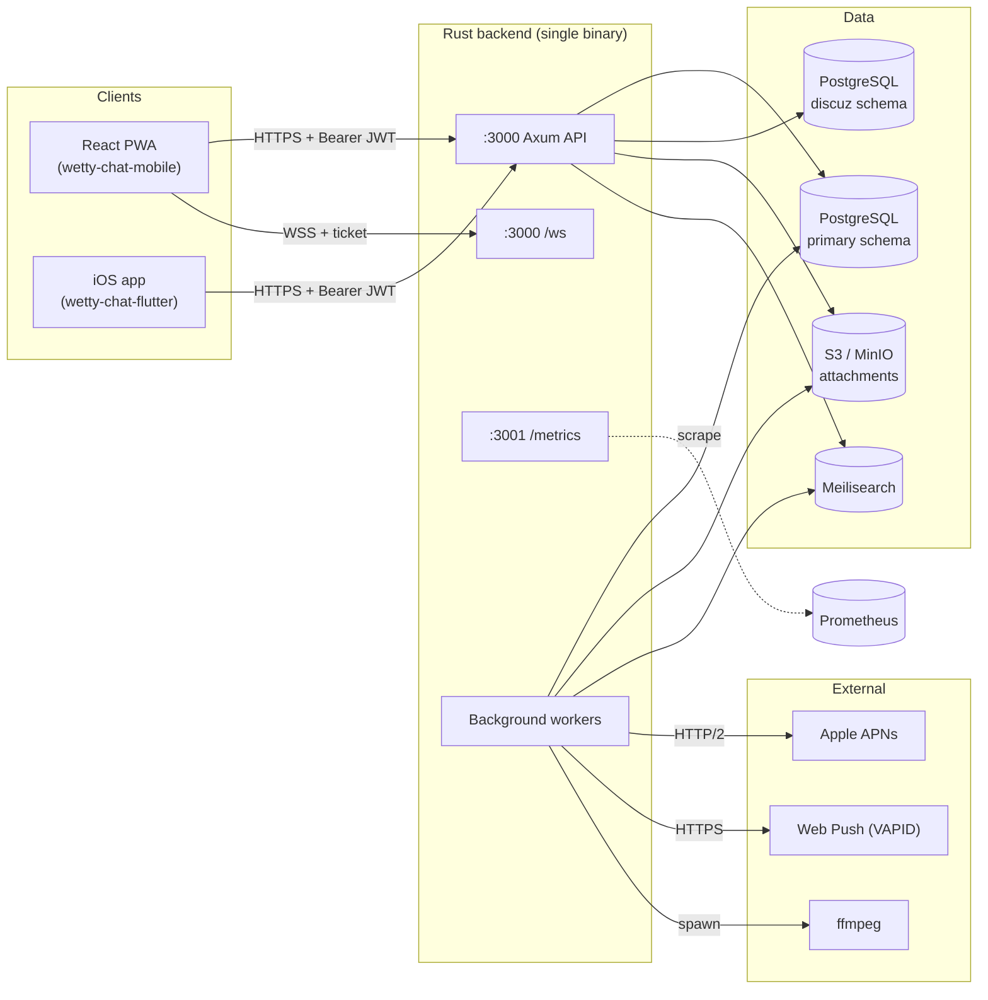
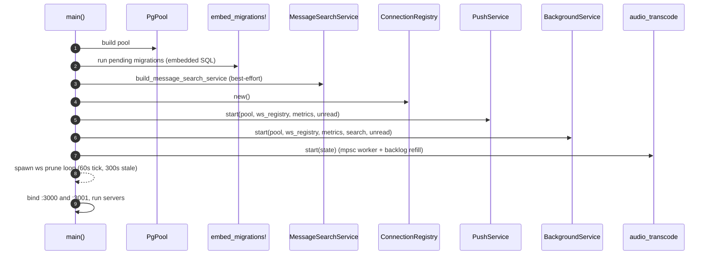
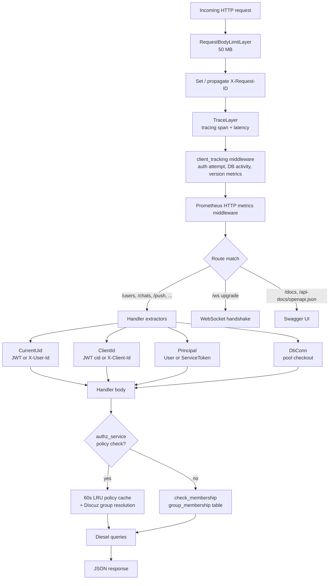
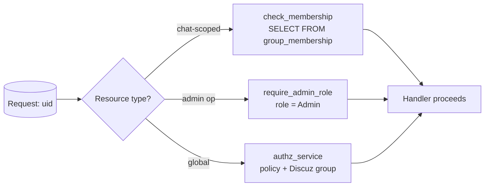
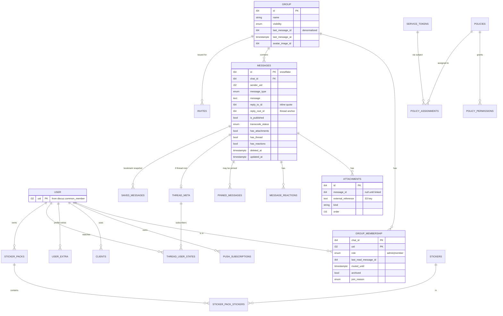
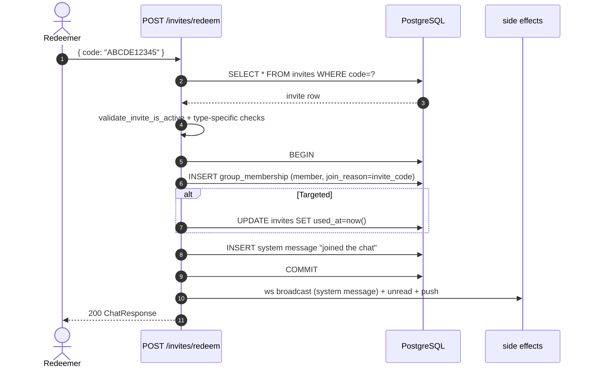
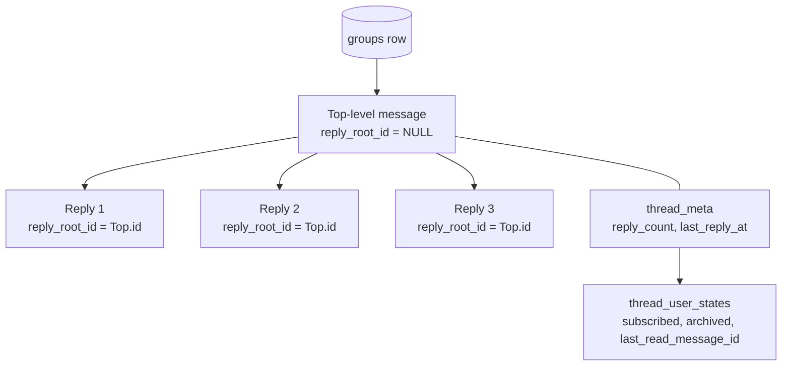
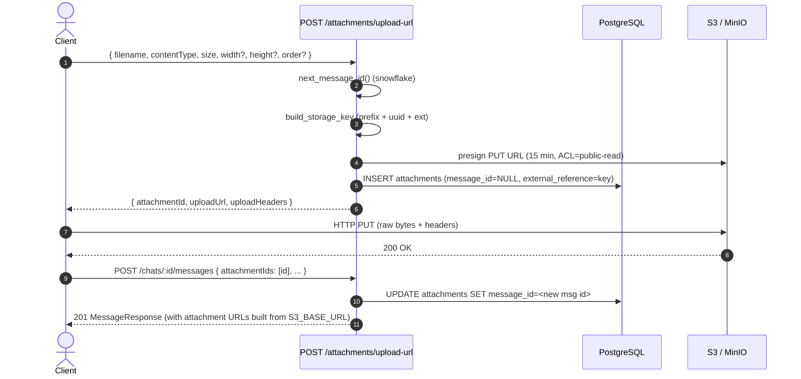
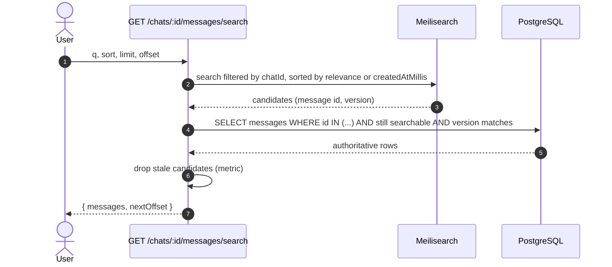

# wetty-chat Backend Architecture

A deep technical overview of the `backend/` Rust service: how authentication,
chat messaging, real-time delivery, push notifications, search and background
jobs fit together.

> Audience: backend engineers and operators. Read this end-to-end to understand
> the runtime; the per-section call paths point you to source files.

---

## Table of contents

1. [System overview](#1-system-overview)
2. [Tech stack & process layout](#2-tech-stack--process-layout)
3. [Application state and startup](#3-application-state-and-startup)
4. [Request pipeline & authentication](#4-request-pipeline--authentication)
5. [Data model](#5-data-model)
6. [Sending a message — end-to-end](#6-sending-a-message--end-to-end)
7. [WebSocket real-time sync](#7-websocket-real-time-sync)
8. [Push notifications (Web Push + APNs)](#8-push-notifications-web-push--apns)
9. [Chats, groups, members and invites](#9-chats-groups-members-and-invites)
10. [Threads](#10-threads)
11. [Unread service](#11-unread-service)
12. [Attachments & S3](#12-attachments--s3)
13. [Audio transcoding](#13-audio-transcoding)
14. [Background jobs](#14-background-jobs)
15. [Message search (Meilisearch)](#15-message-search-meilisearch)
16. [Observability](#16-observability)
17. [Environment variables](#17-environment-variables)
18. [Source tree map](#18-source-tree-map)

---

## 1. System overview

`wetty-chat-backend` is a single Rust binary built on **Axum** that serves:

- A REST/JSON API for chats, messages, attachments, invites, push subscriptions,
  stickers, etc.
- A WebSocket endpoint (`/ws`) that pushes typed JSON events to connected
  clients (no client→server messaging beyond auth/keepalive).
- A Prometheus metrics server on a **separate TCP port** (`/metrics`).

It is **identity-federated**: users are owned by an external **Discuz forum**
PostgreSQL schema; the backend never stores or verifies passwords. Identity
comes in as a JWT (HS256) or, in local/legacy mode, as an `X-User-Id` header.



---

## 2. Tech stack & process layout

| Concern | Choice |
|--------|--------|
| HTTP framework | **Axum** + Tower middleware |
| ORM / SQL | **Diesel** with a `r2d2` connection pool |
| Database | **PostgreSQL** (two schemas: `primary`, `discuz`) |
| Object storage | **S3** API (real S3 or MinIO via `S3_ENDPOINT_URL`) |
| Real-time | **Axum WebSocket** + in-process `mpsc` fanout |
| Push | **`web-push`** (VAPID) + **`a2`** (APNs token auth) |
| Search | **Meilisearch** (optional, opt-in) |
| Async runtime | **Tokio** (multi-threaded, default flavor) |
| Auth tokens | **`jsonwebtoken`** HS256 |
| IDs | **Ferroid** Snowflake-style `i64` |
| Tracing | `tracing` + `tower-http::TraceLayer`, JSON or pretty |
| Metrics | `prometheus` (custom registry on separate port) |

Two HTTP listeners are bound in `main`:

- `APP_ADDR` (default `0.0.0.0:3000`) — public API + WS + Swagger UI (`/docs`)
- `METRICS_ADDR` (default `0.0.0.0:3001`) — `/metrics`

```rust
// backend/src/main.rs  (excerpt)
let api_server = axum::serve(app_listener, app);
let metrics_server = axum::serve(metrics_listener, metrics_app);
tokio::select! { ... }
```

---

## 3. Application state and startup

A single `AppState` value is built in `main()` and cloned per request via
`with_state(state)`. It owns every cross-request resource:

```rust
// backend/src/main.rs (excerpt)
pub(crate) struct AppState {
    db: Pool<ConnectionManager<PgConnection>>,
    id_gen: Arc<utils::ids::IdGen>,                       // snowflakes
    metrics: Arc<metrics::Metrics>,
    authz_service: Arc<services::authz::AuthorizationService>,
    ws_registry: Arc<services::ws_registry::ConnectionRegistry>,
    push_service: Arc<services::push::PushService>,
    unread_service: Arc<services::unread::UnreadService>,
    client_tracking: Arc<services::client_tracking::ClientTrackingService>,
    background_service: Arc<services::background::BackgroundService>,
    message_search: Option<Arc<services::message_search::MessageSearchService>>,
    s3_client: aws_sdk_s3::Client,
    s3_bucket_name: String,
    s3_attachment_prefix: String,
    s3_base_url: Option<String>,
    pub auth_method: AuthMethod,
    pub discuz_avatar_public_url: Option<String>,
    pub discuz_avatar_path: Option<String>,
    pub jwt_signing_key: Vec<u8>,
    pub service_token_hash_key: Vec<u8>,
}
```

Startup order:



The worker tasks are spawned with **supervisor wrappers**: if a worker panics
the task logs the error, sleeps 1s, and restarts.

---

## 4. Request pipeline & authentication

### 4.1 Identity model

| Layer | Carrier | Verifier |
|------|---------|----------|
| **User identity** | HTTP `Authorization: Bearer <JWT>` or `X-User-Id` (legacy/dev) | `utils/auth.rs` |
| **Device / client** | JWT claim `cid` or `X-Client-Id` header | `utils/auth.rs` |
| **Service tokens** (S2S) | `Authorization: Bearer svc_<token>_<secret>` | `services/service_tokens.rs` |
| **WebSocket** | JWT *ticket* obtained via `/ws/ticket`, sent as first WS message | `handlers/ws/mod.rs` |

JWT claims (`utils/auth.rs`):

```rust
pub struct AuthClaims { pub uid: i32, pub cid: String, pub gen: i32 }
```

The JWT is HS256, signed with `JWT_SIGNING_KEY_BASE64` (≥ 32 bytes after
decode). Expiration is **not** validated today (`validate_exp = false`); the
`gen` claim is reserved for future invalidation.

`AuthMethod` selects how a missing Bearer is treated:

| `AUTH_METHOD` | Behavior |
|---------------|----------|
| `JwtOnly` (default) | No Bearer ⇒ `401 Missing auth token` |
| `UIDHeader` | No Bearer ⇒ trust `X-User-Id` (local/dev only) |

### 4.2 Pipeline



### 4.3 Authorization layers

Two distinct authorization mechanisms coexist:

1. **`AuthorizationService` (RBAC)** — `services/authz.rs`. Policy assignments
   on Users, Discuz groups, or service tokens. Cached 60s per
   `(subject, resource_type, resource_id)`. Used today for global actions
   only:

    | Action | Used by |
    |--------|---------|
    | `chat.create` | `POST /group` |
    | `member.viewAll` | `GET /users/search` (non-exact) |
    | `invite.create` | `POST /external/invites` (service token) |
    | `serviceToken.manage` | `/service-tokens/*` |
    | `permission.all` | super-user |

2. **Per-chat membership** — direct DB checks via
   `members::check_membership(conn, chat_id, uid)` and
   `require_admin_role(...)`. This is what gates every message, attachment,
   thread, and reaction operation.



### 4.4 Service tokens

For server-to-server callers (e.g. an external invite bot):

- Credential format `svc_{32-hex-token}_{64-hex-secret}` (shown once on
  create/rotate).
- Stored as `(token, secret_hash)` where `secret_hash =
  HMAC_SHA256(SERVICE_TOKEN_HASH_KEY_BASE64, "wetty-chat-service-token:v1:" ||
  token || ":" || secret)`.
- Verified in constant time; soft-revoked via `revoked_at`.
- Authenticated through the `Principal` extractor; routes that accept them are
  mounted under `/external/`.

---

## 5. Data model

### 5.1 Entity overview



### 5.2 Discuz schema (read-only)

| Table | Used for |
|-------|----------|
| `discuz.common_member` | `uid`, `username`, `groupid`, etc. |
| `discuz.common_member_profile` | `gender` (manual schema, `discuz_manual.rs`) |
| `discuz.common_usergroup` | group title / colors |

User profiles, search, and Discuz-group-based authorization read these tables
directly. Avatars are served from the filesystem (`DISCUZ_AVATAR_PATH`) and
exposed via `DISCUZ_AVATAR_PUBLIC_URL`.

### 5.3 Notable primary tables

24 tables in the primary schema. Highlights:

| Group | Tables |
|-------|--------|
| Chat core | `groups`, `group_membership`, `messages`, `attachments`, `message_reactions`, `pinned_messages` |
| Threads | `thread_meta`, `thread_user_states` |
| Invites | `invites` |
| Push | `push_subscriptions` |
| Auth | `policies`, `policy_permissions`, `policy_assignments`, `service_tokens` |
| User extras | `user_extra`, `clients`, `usergroup_extra` |
| Stickers | `stickers`, `sticker_packs`, `sticker_pack_stickers`, `user_sticker_pack_subscriptions`, `user_favorite_stickers` |
| Saved messages | `saved_messages` (full JSON snapshots) |
| Media | `media` (avatars + sticker source files) |
| Telemetry | `activity_daily_metrics` |

Schema definitions: `backend/src/schema/primary.rs`.
Diesel migrations: `backend/migrations/*` (46 application migrations applied
on startup via `embed_migrations!`).

### 5.4 IDs

- **User `uid`** is `i32`, owned by Discuz — the backend never allocates it.
- **All other entity IDs** are `i64` Snowflakes generated by `ferroid` in
  `utils/ids.rs` (timestamp 47 bits, machine 4 bits, sequence 12 bits;
  `NODE_ID` env selects the machine bits).
- On the wire IDs are serialized as **strings** (`serde_i64_string`) to survive
  JavaScript number precision.

---

## 6. Sending a message — end-to-end

This is the central flow. It ties together: REST, DB, WS fanout, push,
unread cache, search index, and (for audio) the transcode worker.

### 6.1 REST endpoint

`POST /chats/{chat_id}/messages` (or
`POST /chats/{chat_id}/threads/{thread_id}/messages` for thread replies).

Body (camelCase, see `dto/messages.rs`):

```json
{
  "clientGeneratedId": "uuid-from-client",
  "messageType": "text",
  "message": "Hello",
  "replyToId": null,
  "attachmentIds": [],
  "mentions": []
}
```

### 6.2 Lifecycle diagram

```mermaid
sequenceDiagram
    autonumber
    actor Sender
    participant Handler as POST /chats/:id/messages
    participant DB as PostgreSQL
    participant SE as PendingSideEffects
    participant WS as ConnectionRegistry
    participant Push as PushService (mpsc)
    participant Unread as UnreadService
    participant Search as MessageSearchService
    participant Audio as AudioTranscodeService

    Sender->>Handler: HTTP POST + JWT
    Handler->>DB: check_membership(chat_id, uid)
    Handler->>Handler: validate type / payload / mentions

    Handler->>DB: BEGIN
    Handler->>DB: ferroid next_message_id
    Handler->>DB: INSERT messages (is_published=true,<br/>audio→false)
    Handler->>DB: UPDATE groups.last_message_* (top-level + published)
    Handler->>DB: UPDATE attachments.message_id = new id
    Handler->>DB: mark_chat_as_read (sender)
    Handler->>DB: COMMIT

    Handler->>SE: build_message_side_effects()
    SE->>DB: SELECT uid FROM group_membership WHERE chat_id=?
    SE-->>Handler: PendingSideEffects { ws_msg, push_job, unread_event }
    Handler->>Unread: observe_top_level_message (counted unless audio)
    Handler->>WS: broadcast_to_uids(member_uids, Message event)
    Handler->>Push: enqueue(PushJob)
    Handler->>Search: upsert_message_best_effort()  (spawn)
    Handler-->>Sender: 201 MessageResponse

    alt Audio message
        Handler->>Audio: enqueue_message(id)
        Audio->>DB: download attachment metadata
        Audio->>S3: GET original
        Audio->>Audio: ffmpeg → OGG/Opus
        Audio->>S3: PUT canonical
        Audio->>DB: BEGIN; swap attachment; is_published=true; transcode_status=done
        Audio->>SE: build_message_side_effects(enqueue_push=true)
        Audio->>WS: broadcast_to_uids(member_uids, Message)
        Audio->>Push: enqueue(PushJob)
    end
```

### 6.3 Key code paths

| Step | Location |
|------|----------|
| Handler | `backend/src/handlers/chats/messages.rs` (`post_message`, `post_thread_message`) |
| Insert + side-effect build | `backend/src/handlers/chats/mod.rs` (`send_prepared_message`, `build_message_side_effects`) |
| Side-effect fanout | `PendingSideEffects::fire` in same file |
| WS fanout | `backend/src/services/ws_registry.rs` (`broadcast_to_uids`) |
| Push enqueue | `backend/src/services/push/mod.rs` (`enqueue`) |
| Search upsert | `backend/src/services/message_search/mod.rs` (`upsert_message_best_effort`) |
| Audio path | `backend/src/services/audio_transcode.rs` |

### 6.4 Edit and delete

- **Edit** (`PATCH /chats/:c/messages/:m`): sender-only, in-place
  `UPDATE`, sets `updated_at`, swaps linked attachments. No history table.
  Emits `messageUpdated` WS + best-effort search reindex.
- **Soft delete** (`DELETE /chats/:c/messages/:m`): sender or admin; sets
  `deleted_at`. Recalculates `thread_meta` if a thread reply and
  `groups.last_message_*` if it was the chat's last. Emits `messageDeleted`,
  removes from search, adjusts unread cache.

---

## 7. WebSocket real-time sync

The WS layer is a **server-push notification bus**. Clients never send chat
messages over WS — only `auth`, `ping`, and `appState`.

### 7.1 Connection lifecycle

```mermaid
sequenceDiagram
    autonumber
    actor Client
    participant API as REST /ws/ticket
    participant WS as GET /ws (upgrade)
    participant Auth as decode_auth_token
    participant Reg as ConnectionRegistry
    participant Task as handle_socket task
    participant Prune as prune_stale (60s loop)

    Client->>API: GET /ws/ticket (Bearer JWT or X-User-Id + X-Client-Id)
    API-->>Client: { ticket: "<JWT>" }
    Client->>WS: WebSocket Upgrade
    WS-->>Client: 101 Switching Protocols
    Client->>Task: {type:"auth", ticket:"<JWT>"}  (within 5s)
    Task->>Auth: HS256 verify
    Auth-->>Task: uid
    Task->>Reg: register(uid) → mpsc::Sender (buffer 256)
    Reg-->>Client: {type:"presenceUpdate", payload:{activeConnections:N}}
    loop while connected
        Client->>Task: {type:"ping", state:"active"}
        Task-->>Client: {type:"pong"}
        Task->>Reg: update last_ping_at, app_state
    end
    Prune->>Reg: remove entries with last_ping_at older than 300s
    Reg->>Task: (orphaned; next send/recv fails)
    Task->>Reg: remove_connection(uid, conn_id)
    Reg-->>Client: {type:"presenceUpdate"} to remaining tabs
```

Auth failures within 5s, malformed first message, or bad JWT → connection is
silently closed.

### 7.2 Connection registry

`services/ws_registry.rs` keeps one global `DashMap<uid, Vec<ConnectionEntry>>`.
Each entry holds:

- `conn_id` (monotonic)
- `tx: mpsc::Sender<Arc<ServerWsMessage>>` (buffer 256)
- `last_ping_at: AtomicU64`
- `app_state: AtomicU8` (`Active`/`Inactive`)

Important properties:

- Indexed **by user only** — not by chat. Fanout resolves chat members from
  PostgreSQL each time.
- **Multiple connections per user** are supported (browser tab + iOS, etc.).
- Fanout uses `try_send` (non-blocking): if a slow consumer fills its 256-slot
  queue the message is **dropped** and counted in
  `ws_messages_dropped_total`. The REST path never blocks.
- `should_suppress_push(uid, 30)` returns true only if any connection both
  pinged within 30s **and** reports `Active` app state — this is what gates
  push delivery.

### 7.3 Server → client event catalog

All events are JSON with shape `{"type": "...", "payload": {...}}`, camelCase
field names. IDs are strings.

| `type` | Payload | Source of truth |
|--------|---------|-----------------|
| `message` | `MessageResponse` | new message published |
| `messageUpdated` | `MessageResponse` | edit, transcode publish, etc. |
| `messageDeleted` | `MessageResponse` | soft delete |
| `messagesBulkDeleted` | `{chatId, messageIds[]}` | background bulk delete job |
| `reactionUpdated` | `{messageId, chatId, reactions[]}` | reaction add/remove |
| `presenceUpdate` | `{activeConnections}` | own connections count |
| `threadUpdate` | `{threadRootId, chatId, lastReplyAt, replyCount}` | thread activity |
| `threadMembershipChanged` | `{threadRootId, chatId}` | subscribe/unsubscribe |
| `chatArchiveStateChanged` | `{chatId, archived, mutedUntil?}` | archive/mute toggle |
| `pinAdded` / `pinRemoved` | pin payload | pin change |
| `stickerPackOrderUpdated` | `{order[]}` | sticker pack reorder |

`pong` is a raw constant (`{"type":"pong"}` with no `payload`).

### 7.4 Client → server events

| `type` | Fields | Meaning |
|--------|--------|---------|
| `auth` | `ticket` | First message after upgrade |
| `ping` | `state?` (`active`/`inactive`) | Keepalive + presence (default `active`) |
| `appState` | `state?` (default `inactive`) | App lifecycle foreground/background |

There are **no** typing indicators or read-receipt events over WS today —
read state is REST-only.

### 7.5 Fanout call chain (message send)

```
REST handler (POST /chats/:id/messages)
  └── COMMIT
      └── PendingSideEffects::fire(state)
            ├── unread_service.observe_top_level_message(...)
            ├── ws_registry.broadcast_to_uids(member_uids, Arc<ServerWsMessage::Message(...)>)
            │     └── for each ConnectionEntry: tx.try_send(...)
            └── push_service.enqueue(PushJob)
```

`member_uids` are loaded with a fresh `SELECT uid FROM group_membership WHERE
chat_id = ?` for every send — there is no in-memory membership cache for
fanout.

Thread updates fan out to **thread subscribers** (from `thread_user_states`),
not all chat members.

---

## 8. Push notifications (Web Push + APNs)

### 8.1 Subscription endpoints (`/push`)

| Method | Path | Notes |
|--------|------|-------|
| `GET` | `/push/vapid-public-key` | Public (no auth) |
| `POST` | `/push/subscribe` | Requires `CurrentUid` + `X-Client-Id`/`cid` |
| `POST` | `/push/unsubscribe` | Same |
| `GET` | `/push/subscription-status` | Same |

`/push/subscribe` body (see `handlers/push.rs::SubscribeBody`):

```json
// Web Push (default)
{ "endpoint":"...", "keys": {"p256dh":"...", "auth":"..."} }

// APNs
{ "provider":"apns", "deviceToken":"<hex>", "environment":"sandbox|production" }
```

Subscriptions are stored in `push_subscriptions` (Diesel definition in
`schema/primary.rs`). Per-provider unique constraints:

- Web Push: unique `(user_id, endpoint)`
- APNs: unique `(provider, device_token, apns_environment)` — rebinding to a
  new user is supported via `ON CONFLICT ... DO UPDATE`

### 8.2 Worker architecture

```mermaid
flowchart LR
    Send[Message send /<br/>audio transcode complete] -->|PushJob via try_send| Q[(mpsc buffer 1024)]
    Q --> W[push worker<br/>single consumer]
    W --> Cand[load_recipient_candidates<br/>group_membership + thread_user_states]
    Cand --> Pol{should_send_push<br/>policy}
    Pol -->|skip| Drop[drop + metric]
    Pol -->|send| Pres{ws_registry<br/>should_suppress_push<br/>(30s, Active)}
    Pres -->|yes| Sup[suppress + metric]
    Pres -->|no| Targets[target_uids]
    Targets --> Subs[SELECT push_subscriptions WHERE user_id IN ...]
    Subs --> Build[build payload<br/>+ unread badge]
    Build --> F[buffer_unordered=10 deliveries]
    F -->|web| WP[HyperWebPushClient<br/>VAPID AES128GCM]
    F -->|apns| AP[a2 ApnsClient<br/>token auth, sandbox/prod]
    F --> Results[apply_delivery_results]
    Results -->|success| Reset[reset failure counters]
    Results -->|counted failure| Inc[increment, prune at >=3]
    Results -->|stale token / 404 / 410| Del[DELETE subscription]
```

### 8.3 Policy summary

A user receives push for a new message unless one of these applies:

- They are the sender
- They have an active WS connection that pinged within 30s **and** reports
  `Active`
- The chat is archived (mentions still suppressed in archive)
- The chat is muted **and** they are not mentioned / not a reply target
- For thread replies: they are not subscribed to the thread (mentions still
  send a one-off)

### 8.4 Localization

| Provider | Wire payload |
|----------|--------------|
| Web Push | Pre-rendered **English** text (`title`, `body`, `messagePreview`, structured `data`). The PWA service worker can localize via its own resource bundles. |
| APNs | `title-loc-key` / `loc-key` + args; the iOS app must ship matching `Localizable.strings`. Custom data nested under `wettyChat` for deep-linking. |

### 8.5 Failure handling

- Web Push 404 / 410 → prune subscription row immediately.
- APNs `BadDeviceToken` / `DeviceTokenNotForTopic` / `Unregistered` → prune.
- Transient errors → increment `delivery_failure_count`; prune after 3.
- Successful delivery resets failure counters.
- `client_tracking` separately purges subscriptions for clients inactive
  > 45 days.

### 8.6 APNs auth (token-based)

The backend never uses APNs TLS certificates. It loads the `.p8` private key
from `APNS_PRIVATE_KEY_PATH` and lets the `a2` crate sign each HTTP/2 request
with JWT (Key ID + Team ID). One key serves both endpoints — the worker holds
two `ApnsClient`s (sandbox + production) and picks one per subscription's
`apns_environment`.

See `backend/README.md` for the Apple-side setup walkthrough.

---

## 9. Chats, groups, members and invites

### 9.1 One model, two names

The API talks about "chats"; the DB calls them `groups`. There is no
separate DMs table — a 1-on-1 chat is just a `groups` row with two
`group_membership` rows. `GroupVisibility` (`public`, `semi_public`,
`private`) only controls discoverability in group search.

### 9.2 Endpoint surface

| Concern | Endpoints |
|---------|-----------|
| Chat lifecycle | `POST /group`, `GET /group/:id`, `PATCH /group/:id`, `POST /group/:id/avatar/upload-url`, `PUT/DELETE /group/:id/mute` |
| Membership | `GET/POST /group/:id/members`, `PATCH/DELETE /group/:id/members/:uid` |
| Inbox | `GET /chats`, `GET /chats/unread`, `GET /chats/:id/unread`, `POST /chats/:id/read`, `POST /chats/:id/unread`, `PUT/DELETE /chats/:id/archive` |
| Messages | `GET/POST /chats/:id/messages`, `GET/PATCH/DELETE /chats/:id/messages/:m`, `GET /chats/:id/messages/search` |
| Reactions | `GET /chats/:id/messages/:m/reactions`, `PUT/DELETE /chats/:id/messages/:m/reactions/:emoji` |
| Pins | `GET/POST /chats/:id/pins`, `DELETE /chats/:id/pins/:pin_id` |
| Attachments | `POST /attachments/upload-url`, `GET /chats/:id/attachments` |
| Threads | `GET /threads`, `GET /threads/unread`, `POST /threads/:rid/read`, `GET .../read-state`, `GET/PUT/DELETE /chats/:id/threads/:rid/subscribe`, `PUT/DELETE .../archive`, `POST /chats/:id/threads/:rid/messages` |
| Invites | `GET/POST /invites`, `GET/PATCH/DELETE /invites/invite[/:id]`, `POST /invites/send`, `POST /invites/redeem`, `POST /external/invites` |
| Push | `/push/*` (see §8) |
| Saved messages | `GET /saved-messages`, `PUT /saved-messages/:m`, `DELETE /saved-messages/by-message/:m`, `DELETE /saved-messages/by-id/:s`, `GET /chats/:id/saved-messages` |
| Stickers | `/stickers/*`, `/packs/*` (user-owned sticker packs + subscriptions + favorites) |
| Users | `GET /users/me`, `GET /users/search`, `GET /users/auth-token`, `PUT /users/me/stickerpack-order` |
| Service tokens (admin) | `/service-tokens/*` (CRUD + rotate, requires `serviceToken.manage`) |
| External (S2S) | `POST /external/invites/` (service token + `invite.create`) |
| WS | `GET /ws/ticket`, `GET /ws`, `GET /ws/` |
| Docs | `/docs` (Swagger UI), `/api-docs/openapi.json` |

### 9.3 Invites

Stored in `invites`:

| Type | Who can use | Single-use? |
|------|-------------|-------------|
| `Generic` | anyone with the 10-char code | no |
| `Targeted` | `target_uid` only | yes (sets `used_at`) |
| `Membership` | redeemer must be a member of `required_chat_id` | no |

Codes are 10 alphanumeric characters from a curated alphabet (no ambiguous
characters like `0/O`, `1/I`). Active = not revoked **and** not expired.
Revocation is soft (`revoked_at`).

Invite redemption flow:



### 9.4 Chat list assembly

`GET /chats` builds the inbox by:

1. `groups INNER JOIN group_membership ON chat_id` filtered by `uid` and
   `archived`.
2. `LEFT JOIN messages ON groups.last_message_id` for the preview.
3. `LEFT JOIN media` for the chat avatar.
4. Sort by `last_message_at DESC NULLS LAST, id DESC`.
5. Batch unread counts via `UnreadService::count_membership_unreads`.
6. Hydrate `last_message` through `attach_metadata` (sender, sticker,
   attachments, mentions) → trim to `MessagePreview`.

The frontend assembles its main chat list from this single endpoint plus
incoming WS events.

---

## 10. Threads

Threads are **reply chains under a top-level text message**, not separate
chats.



Rules:

- Root must be a **text** message; non-text messages cannot have threads.
- First reply auto-sets `messages.has_thread = true` on the root.
- Replying auto-subscribes the replier, the root author, and any mentioned
  users.
- `thread_meta` is maintained incrementally on insert/delete.
- **Chat list previews ignore thread replies**: `groups.last_message_*` is
  updated only for top-level published messages.
- The unread service likewise only counts top-level messages for chat
  unread; thread unread is tracked separately via `thread_user_states`.

`GET /threads` returns the user's subscribed thread inbox (across chats);
`GET /threads/unread` aggregates thread unread counts; WS pushes
`threadUpdate` and `threadMembershipChanged` events to subscribers only.

---

## 11. Unread service

`services/unread/` is an **in-memory, lazily-loaded** counter cache. It is
not a persisted column.

```mermaid
flowchart TB
    subgraph UnreadService
        Map["DashMap<chat_id, Mutex<ChatUnreadCacheEntry>>"]
        Map --> Fenwick[Fenwick tree<br/>over top-level message IDs]
    end

    PG[(messages table)] -->|first access:<br/>SELECT id, deleted_at, is_published<br/>WHERE chat_id=? AND reply_root_id IS NULL| Map

    Send[Message send] -->|observe_top_level_message| Map
    Delete[Message delete] -->|observe_top_level_message_counted(false)| Map
    Bulk[Bulk delete job] -->|invalidate_chat| Map

    Map -->|count(uid)| Inbox[/GET /chats/]
    Map -->|count_users_unread_totals| Push[Push worker badge]
    Map -->|count_membership_unreads| List[Chat list assembly]
```

Properties:

- Cache is per-process (no Redis). Restarts re-warm lazily.
- Counts published, non-deleted, top-level messages with
  `id > last_read_message_id`.
- Capped at `MAX_UNREAD_COUNT = 1000`.
- Thread replies do not count toward chat unread.
- `archived` and currently-muted memberships are excluded from aggregate
  badge totals (but per-chat counts still return the underlying value).
- Read state itself (`last_read_message_id`) is persisted in
  `group_membership` and `thread_user_states`.

---

## 12. Attachments & S3

Attachments are uploaded **before** the message that references them:



Reads use public URLs built as `{S3_BASE_URL}/{external_reference}` — no
per-read presigning. Images preserve dimensions for layout hints; audio is
stored as-uploaded and then replaced by the canonical transcode.

Sticker uploads go through a different path that resizes to WebP
(`services/image_processing.rs`); message attachments are stored as-is.

Group avatars use the same `media` table via `POST /group/:id/avatar/upload-url`.

---

## 13. Audio transcoding

Audio messages take a deferred-publish path so callers get a fast HTTP
response while the heavy work happens in a background worker.

```mermaid
flowchart LR
    Send[POST audio message] -->|is_published=false<br/>transcode_status=pending| DB[(messages)]
    Send -->|enqueue_message id| Q[(mpsc buffer 64)]
    BL[backlog refill loop] --> PG2[SELECT pending audio]
    PG2 --> Q

    Q --> W[transcode worker]
    W --> S3in[S3 GET original]
    S3in --> FF[ffmpeg<br/>→ Ogg/Opus]
    FF --> S3out[S3 PUT canonical]
    S3out --> TX[BEGIN]
    TX --> DBup[UPDATE attachment + messages]
    DBup -->|first publish| SE[build_message_side_effects + fire]
    SE --> WS[ws Message]
    SE --> Push[push enqueue]
    DBup -->|already published<br/>(re-encode)| WSUp[ws messageUpdated]
```

Behaviours:

- Already-canonical (`audio/ogg` + `.ogg`) attachments skip ffmpeg and just
  mark `done`.
- On ffmpeg failure the original attachment is published anyway and
  `transcode_status` is set to `failed`.
- The worker enforces a process-level `DashSet` of in-flight message IDs to
  avoid double-processing.

Code: `backend/src/services/audio_transcode.rs`.

---

## 14. Background jobs

`BackgroundService` is an event-driven worker, not a cron scheduler.

```rust
// services/background.rs
pub enum BackgroundJob {
    BulkDeleteMessages { chat_id: i64, target_uid: i32, scope: DeleteScope },
    // future variants...
}
```

Triggered when an admin removes a member with
`?delete_messages=last24h|all`. The worker:

1. Loads `member_uids` from `group_membership`.
2. Soft-deletes messages in batches of 500.
3. Per batch: WS `messagesBulkDeleted` to all members, search index
   batch-delete.
4. After the loop: `unread_service.invalidate_chat`, recalculate
   `groups.last_message_*`, broadcast `threadUpdate` for affected threads.
5. Soft-deletes related attachments.

Other long-running periodic tasks live in their own services:

| Loop | Interval | Location |
|------|---------|----------|
| WS prune stale | 60s | `main.rs` |
| Client tracking purge | 6h | `services/client_tracking.rs` |
| Audio transcode backlog refill | per worker iteration | `services/audio_transcode.rs` |

---

## 15. Message search (Meilisearch)

Opt-in via `MESSAGE_SEARCH_ENABLED=true`. Requires `MEILI_URL` and
`MEILI_MASTER_KEY`.

| Setting | Value |
|---------|-------|
| Index | `MESSAGE_SEARCH_INDEX` (default `messages_v1`) |
| Searchable | `text` |
| Filterable | `chatId` |
| Sortable | `createdAtMillis` |
| Document | `{ id, messageId, chatId, replyRootId, createdAtMillis, version, text }` |

Indexed documents are projected from **published, non-deleted text messages**;
mentions (`@[uid:123]`) are stripped during normalization.



Index maintenance:

| Event | Action |
|-------|--------|
| Message send | `upsert_message_best_effort` (fire-and-forget) |
| Message edit | upsert (re-projects text) |
| Soft delete | `delete_message_best_effort` |
| Bulk delete job | `delete_batch` per chunk |
| Full rebuild | CLI: `cargo run -- message-search-reindex` (deletes all docs, batches 500 from PG by `id`) |

If the index is missing or unhealthy, searches return 503 / `NotReady`.

---

## 16. Observability

### 16.1 Tracing

- `tracing-subscriber` with `EnvFilter` (`RUST_LOG`).
- Pretty or JSON formatter via `BACKEND_LOG_FORMAT` (`pretty` default).
- `tower-http::TraceLayer` opens a span per request including
  `method`, `uri`, `request_id`.
- `X-Request-ID` is generated (UUID) if not present and propagated back to
  the client.
- `db_tracing.rs` installs a Diesel instrumentation that traces every query,
  logs **errors** at `error`, and warns on queries ≥ 10 ms at `warn`.

### 16.2 Metrics

Exposed on `METRICS_ADDR/metrics`. Selected families:

| Category | Examples |
|---------|----------|
| HTTP | `http_requests_total`, `http_request_duration_seconds`, `http_multipart_duration_seconds` |
| Messages | `messages_total{chat_id}` |
| WebSocket | `ws_connected_users`, `ws_active_connections`, `ws_inactive_connections`, `ws_connections_total`, `ws_connection_duration_seconds`, `ws_messages_pushed_total`, `ws_messages_dropped_total` |
| Push | `push_notifications_total{provider,result}`, `push_notification_jobs_total`, `push_notification_job_duration_seconds`, `push_notifications_suppressed_total`, `push_delivery_failures_total{provider,class}`, `push_subscription_prunes_total{provider,reason}` |
| Background | `background_jobs_total`, `background_job_duration_seconds` |
| Audio transcode | `audio_transcode_source_total`, `audio_transcode_jobs_total`, `audio_transcode_job_duration_seconds` |
| Client tracking | `client_activity_writes_total`, `client_rebinds_total`, `client_tracking_purge_total`, `activity_daily_rollup_updates_total`, plus `activity_today_*` gauges |
| App version | `app_version_requests_total{version}`, `app_version_unique_clients{version}` |
| Search | index ops, query latency, candidate/result histograms, candidate drops, reindex duration/docs/timestamp |
| Discuz | avatar lookup duration (overall + FS), user count |

### 16.3 OpenAPI

`utoipa` paths are merged from handler modules with the base in
`openapi.rs`. Swagger UI lives at `/docs`. Security schemes declared:
`uid_header`, `bearer_jwt`, `service_token_bearer`.

### 16.4 Errors

All HTTP handlers return `Result<_, AppError>` defined in `errors.rs`:

```rust
pub enum AppError {
    DbPool(diesel::r2d2::PoolError),      // 500
    DbQuery(diesel::result::Error),       // 500
    BadRequest(&'static str),             // 400
    Unauthorized(&'static str),           // 401
    Forbidden(&'static str),              // 403
    NotFound(&'static str),               // 404
    Conflict(&'static str),               // 409
    Gone(&'static str),                   // 410
    ServiceUnavailable(&'static str),     // 503
    Internal(&'static str),               // 500
}
```

Domain errors (`MessageSearchError`, etc.) are converted at the handler
boundary into `AppError` variants.

---

## 17. Environment variables

| Variable | Required | Purpose |
|----------|----------|---------|
| `DATABASE_URL` | Yes | PostgreSQL connection (primary + `discuz` schema) |
| `JWT_SIGNING_KEY_BASE64` | Yes | HS256 JWT signing key (≥ 32 bytes decoded) |
| `S3_BUCKET_NAME` | Yes | S3 bucket for attachments / media |
| `S3_ENDPOINT_URL` | No | Custom endpoint (MinIO etc.); enables path-style |
| `S3_BASE_URL` | No | Public read base URL |
| `ATTACHMENTS_PREFIX` | No | S3 key prefix (default `attachments`) |
| `SERVICE_TOKEN_HASH_KEY_BASE64` | No | HMAC key (falls back to JWT key) |
| `AUTH_METHOD` | No | `UIDHeader` for dev; default `JwtOnly` |
| `APP_ADDR` | No | API socket (default `0.0.0.0:3000`) |
| `METRICS_ADDR` | No | Metrics socket (default `0.0.0.0:3001`) |
| `CORS_ALLOWED_ORIGINS` | No | Comma-separated; enables CORS with credentials |
| `NODE_ID` | No | Snowflake machine ID (default 0) |
| `RUST_LOG` | No | Tracing filter |
| `BACKEND_LOG_FORMAT` | No | `pretty` or `json` |
| `VAPID_PUBLIC_KEY` | Yes | Web Push public key |
| `VAPID_PRIVATE_KEY` | Yes | Web Push signing key |
| `VAPID_SUBJECT` | Yes | VAPID `sub` claim (e.g. `mailto:...`) |
| `APNS_KEY_ID` | If APNs | Apple Auth Key ID |
| `APNS_TEAM_ID` | If APNs | Apple Team ID |
| `APNS_PRIVATE_KEY_PATH` | If APNs | Path to `.p8` private key |
| `APNS_TOPIC` | If APNs | iOS bundle identifier |
| `MESSAGE_SEARCH_ENABLED` | No | Opt-in to Meilisearch |
| `MEILI_URL` | If search | Meilisearch base URL |
| `MEILI_MASTER_KEY` | If search | Meilisearch master key |
| `MESSAGE_SEARCH_INDEX` | No | Index UID (default `messages_v1`) |
| `DISCUZ_AVATAR_PUBLIC_URL` | No | Public base URL for Discuz avatars |
| `DISCUZ_AVATAR_PATH` | No | FS path to Discuz `uc_server/data/avatar` |

---

## 18. Source tree map

```
backend/
├── Cargo.toml
├── README.md                 — APNs setup guide
├── ARCHITECTURE.md           — this document
├── migrations/               — Diesel migrations (46 application + 1 Diesel init)
└── src/
    ├── main.rs               — startup, AppState, listeners, supervisors
    ├── constants.rs          — shared constants
    ├── db_tracing.rs         — Diesel slow-query instrumentation
    ├── errors.rs             — AppError enum + IntoResponse
    ├── extractors.rs         — DbConn extractor
    ├── metrics.rs            — Prometheus registry + middleware
    ├── models.rs             — Diesel Insertable / Queryable structs + enums
    ├── openapi.rs            — utoipa base doc + security schemes
    ├── schema.rs             — re-exports for diesel CLI
    ├── serde_i64_string.rs   — i64-as-string serde helper
    ├── dto/                  — request/response payloads (camelCase)
    │   ├── attachments.rs, chats.rs, groups.rs, invites.rs,
    │   ├── members.rs, messages.rs, pins.rs, push.rs,
    │   ├── saved_messages.rs, service_tokens.rs, stickers.rs,
    │   ├── threads.rs, users.rs, ws.rs, external/
    ├── schema/               — Diesel-generated schemas
    │   ├── primary.rs        — primary chat schema (24 tables)
    │   ├── discuz.rs         — Discuz tables introspected
    │   └── discuz_manual.rs  — extra Discuz tables (e.g. profile)
    ├── handlers/             — Axum routers per feature
    │   ├── mod.rs            — api_router() composition
    │   ├── attachments.rs, groups.rs, invites.rs, members.rs,
    │   ├── pins.rs, push.rs, saved_messages.rs, service_tokens.rs,
    │   ├── stickers.rs, threads.rs, users.rs,
    │   ├── chats/            — messages, reactions, threads under chats
    │   ├── external/         — service-token-authenticated routes
    │   └── ws/               — /ws/ticket + /ws upgrade
    ├── services/             — business logic + workers
    │   ├── mod.rs, authz.rs, background.rs, chat.rs,
    │   ├── client_tracking.rs, invites.rs, media.rs,
    │   ├── image_processing.rs, audio_transcode.rs,
    │   ├── saved_messages.rs, service_tokens.rs, threads.rs,
    │   ├── user.rs, ws_registry.rs,
    │   ├── push/             — PushService, payload, delivery, worker, policy
    │   ├── unread/           — UnreadService Fenwick caches
    │   └── message_search/   — Meilisearch integration + reindex
    └── utils/
        ├── auth.rs           — JWT, extractors, AuthClaims, ClientId
        ├── ids.rs            — Ferroid snowflake generator
        ├── pagination.rs     — common cursor helpers
        └── mod.rs
```

---

## Appendix A — Mental models that help

1. **Identity is borrowed, never created here.** The backend trusts a JWT or
   header that says "I am Discuz uid X" and reads the rest from the
   `discuz.*` schema.
2. **Membership is the gatekeeper for everything per-chat.** `group_membership`
   is queried on virtually every read/write. The RBAC service is reserved
   for global actions and service-to-service flows.
3. **Messages are a single flat table.** Threading and replies are
   `reply_root_id` / `reply_to_id`. The chat list cares only about top-level
   activity.
4. **REST mutates state, WebSocket announces it.** Clients never publish
   chat messages over WS; they read events. Push is fired in the same
   `PendingSideEffects::fire()` step as the WS broadcast.
5. **Fanout reads the DB.** There is no in-memory chat→members index — every
   broadcast issues `SELECT uid FROM group_membership WHERE chat_id = ?`.
6. **The unread service is a cache, not a counter column.** It's lazily
   populated from `messages` and updated as side effects fire.
7. **Background work is best-effort.** Audio transcode, search, push, and
   bulk deletes all use bounded channels with drop-on-full semantics —
   user-facing requests are never blocked by them.
