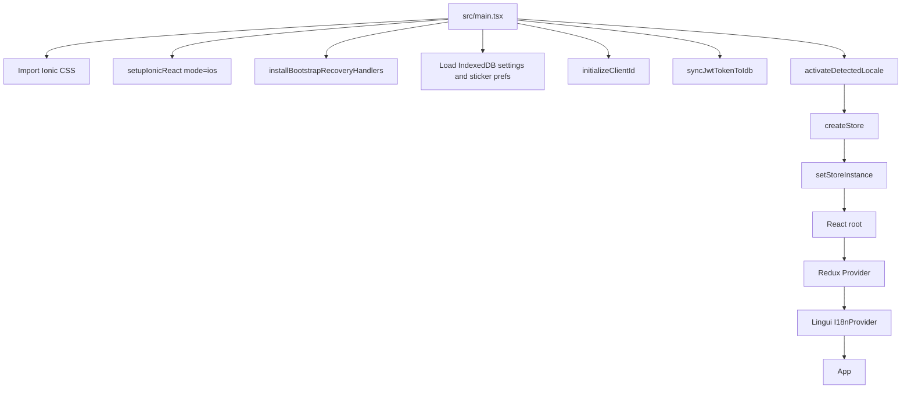
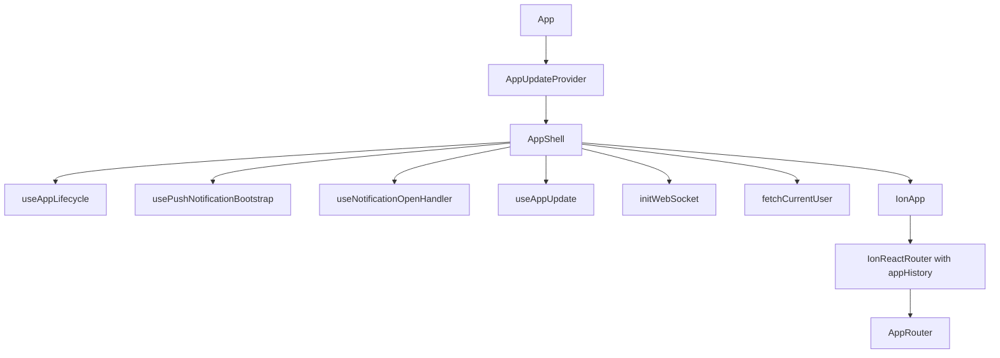
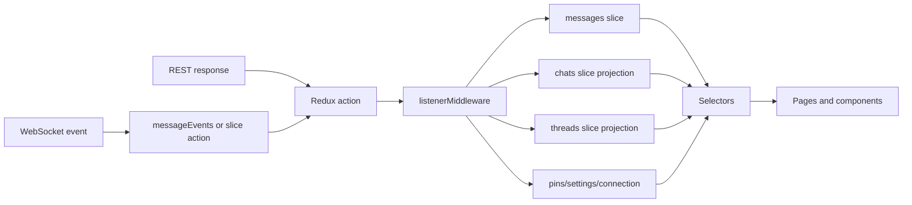
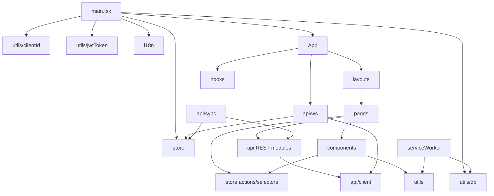
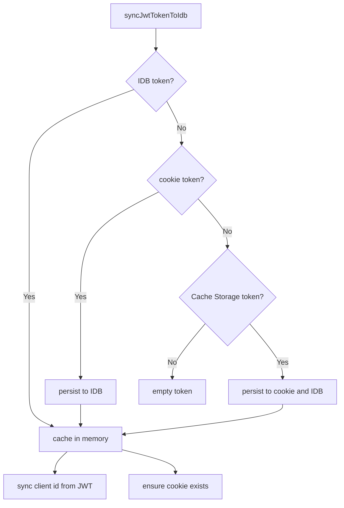
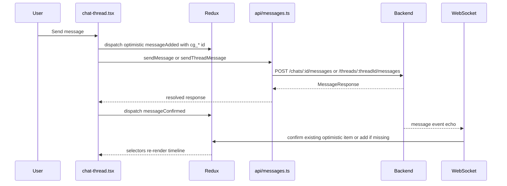
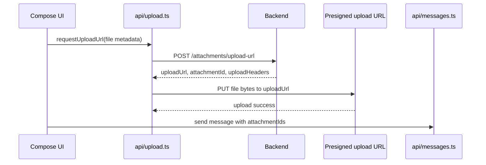
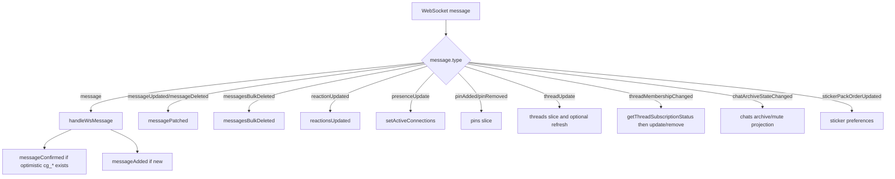
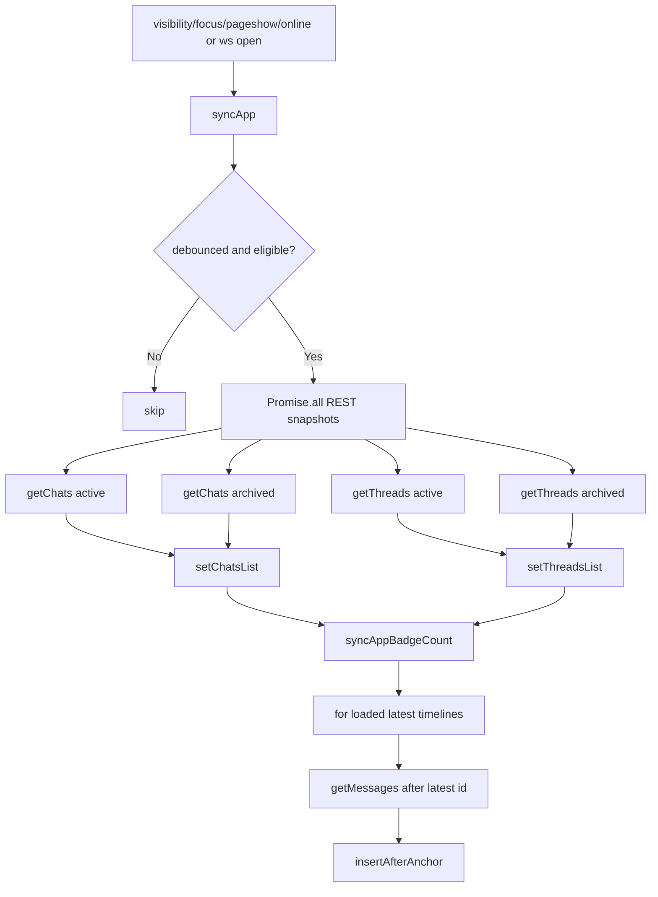
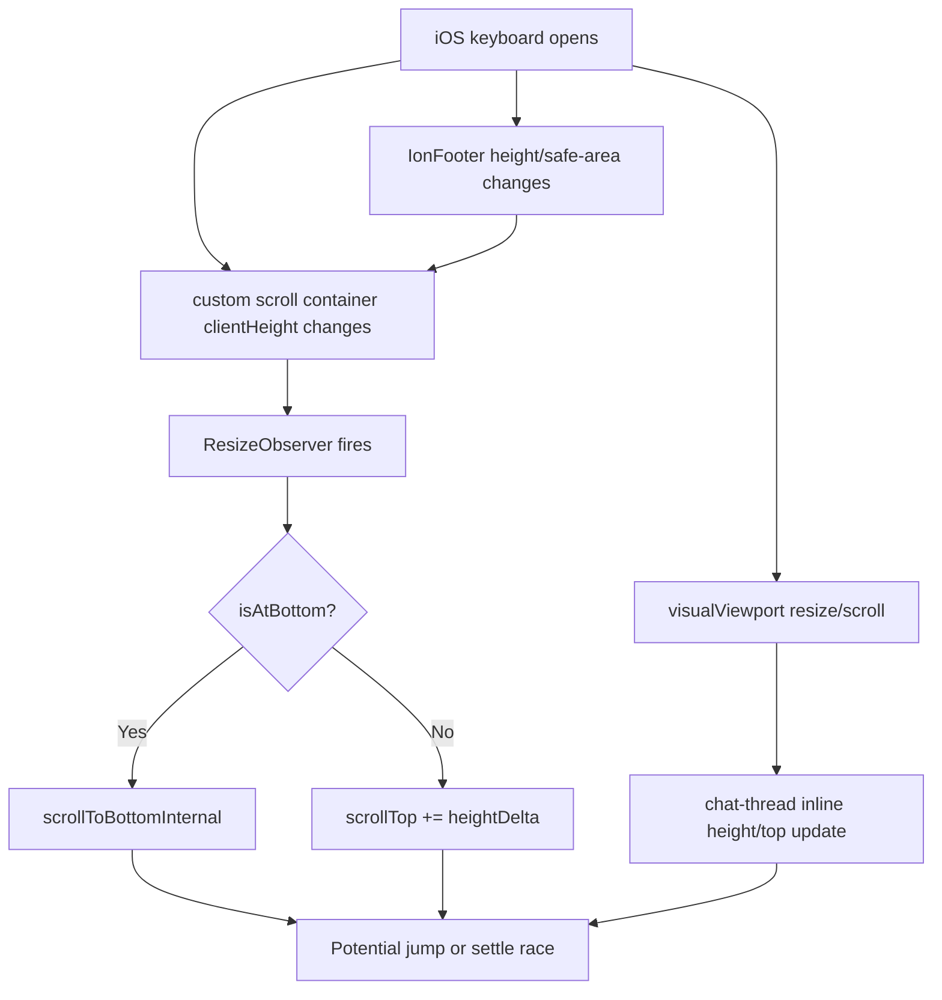

# Frontend Architecture Analysis

This document summarizes the architecture of the `wetty-chat-mobile` frontend, how it communicates with the backend, and the most likely iOS/Safari scrolling risk areas found by static code inspection.

## Executive Summary

The app is a React 19 + Ionic 8 PWA using React Router v5, Redux Toolkit, Axios, WebSocket, Lingui, IndexedDB, and a service worker. The runtime model is centered around Redux: REST calls, WebSocket events, lifecycle sync, push handling, and optimistic message actions all eventually project data into Redux slices that drive Ionic pages and components.

The backend communication model has two main channels: Axios REST modules for request/response workflows and a WebSocket connection for realtime updates. A `syncApp()` recovery path reconciles state after reconnect, foreground, online, and visibility transitions.

The highest iOS/Safari scrolling risk is the chat thread page. It disables Ionic's `IonContent` scrolling and uses a custom virtual scroll container with manual keyboard and viewport compensation. That design can work, but it is fragile on iOS because Safari's visual viewport, soft keyboard, safe areas, address bar, and nested momentum scroll containers interact in browser-specific ways.

## Technology Stack

Primary dependencies from `package.json`:

| Area | Libraries |
| --- | --- |
| App framework | React 19, Ionic React 8 |
| Routing | `@ionic/react-router`, React Router v5 |
| State | Redux Toolkit, React Redux |
| Backend client | Axios, WebSocket |
| PWA | Vite PWA, Workbox |
| Storage | IndexedDB via `idb`, cookies via `js-cookie`, Cache Storage fallback |
| i18n | Lingui |
| Virtual lists | Custom chat virtual scroll, `react-virtuoso` in some list/modal pages |

## Bootstrap And Runtime Shell

Key files:

| File | Responsibility |
| --- | --- |
| `src/main.tsx` | Imports Ionic CSS, configures Ionic in iOS mode, installs bootstrap recovery handlers, hydrates settings/sticker preferences/JWT/client id/locale, creates Redux store, renders React root. |
| `src/App.tsx` | Top-level app shell, lifecycle hooks, push notification bootstrap, notification open handling, service worker update toast, WebSocket initialization, current-user fetch, routing shell. |
| `src/i18n.ts` | Locale activation and Lingui setup. |
| `src/bootstrapRecovery.ts` | Recovery hooks around bootstrap/service worker update failures. |
| `src/serviceWorker.ts` | PWA caching, push notification display, notification click routing, badge handling. |

Bootstrap flow:



App shell flow:



## Routing And Layout Architecture

The app has a small set of public/bootstrap routes, then chooses between a mobile layout and desktop split layout based on `useIsDesktop()`.

Public/bootstrap routes in `src/App.tsx`:

| Route | Page |
| --- | --- |
| `/landing` | `LandingPage` |
| `/oobe` | `OobePage` |
| `/push-open` | `PushOpenPage` |
| `/m/:encoded` | `PermalinkPage` |

Mobile layout is route-outlet based. `src/layouts/MobileLayout.tsx` uses `IonTabs`, `IonRouterOutlet`, and `IonTabBar`. Main route groups include chat lists, archived chats, threads, create/join chat, chat thread, group info, members, invites, saved messages, settings, sticker settings, and optional demo page.

Desktop layout is split-pane based. `src/layouts/DesktopSplitLayout.tsx` manually parses routes with `matchPath()` into `DesktopRouteMatches`. It renders a left chat list pane and a right pane that can show the active chat, a thread overlay, create/join/invite panes, and several modal-based settings/group subpages.

Routing structure:

```mermaid
flowchart TD
  A[IonReactRouter] --> B{AppRouter}
  B --> C[/landing]
  B --> D[/oobe]
  B --> E[/push-open]
  B --> F[/m/:encoded]
  B --> G{OOBE complete?}
  G -->|No| H[Redirect /oobe]
  G -->|Yes| I{Desktop?}
  I -->|No| J[MobileLayout]
  I -->|Yes| K[DesktopSplitLayout]
  J --> L[IonTabs]
  L --> M[IonRouterOutlet route components]
  L --> N[IonTabBar]
  K --> O[Left pane ChatList]
  K --> P[Right pane ChatThreadCore or pane content]
  K --> Q[IonModal subpages]
```

## State Management

Redux Toolkit is the primary application data model. `src/store/index.ts` combines slices, installs listener middleware, creates the store, and exposes a module-level store proxy for imperative modules like WebSocket and sync.

Root slices from `src/store/index.ts`:

| Slice | Responsibility |
| --- | --- |
| `connection` | WebSocket connection status and active connection count. |
| `messages` | Windowed chat/thread timelines, pagination, optimistic and confirmed messages. |
| `settings` | User/application settings. |
| `stickerPreferences` | Sticker pack order, favorite sticker order, auto-sort preferences. |
| `chats` | Chat list snapshots, live projections, unread counts, archive/mute states. |
| `threads` | Thread list buckets, subscriptions, archived state, cached previews. |
| `pins` | Pinned messages per chat. |
| `user` | Current user state and async fetch. |

Message events are centralized in `src/store/messageEvents.ts` and projected by listeners in `src/store/index.ts`. This allows a single message event to update multiple derived surfaces, such as timeline rows, chat list previews, unread counts, thread previews, and thread membership state.

State update pattern:



Notable architectural detail: non-React modules use a proxy exported from `src/store/index.ts`. The real store is set during bootstrap with `setStoreInstance(store)`. This supports imperative updates from `src/api/ws.ts` and `src/api/sync.ts`, but it also means those modules depend on bootstrap ordering.

## Feature And Component Organization

Major folders:

| Folder | Role |
| --- | --- |
| `src/api` | REST API modules, WebSocket, sync. |
| `src/store` | Redux slices, message events, message projection, selectors. |
| `src/pages` | Ionic pages and route-level page cores. |
| `src/components` | Reusable UI, chat list, chat messages, compose UI, modals, media, settings helpers. |
| `src/hooks` | Lifecycle, routing, push, update, draft, scroll/date visibility, platform helpers. |
| `src/utils` | IndexedDB, JWT/client ID, navigation, notifications, message preview/search, media helpers. |
| `locales` | Lingui catalogs. |

High-coupling hotspot:

`src/pages/chat-thread/chat-thread.tsx` is the main orchestration point for chat timelines. It handles message loading, optimistic send/confirm, attachments, pins, reactions, threading, read state, keyboard handling, overlays, modals, virtual scroll integration, and compose integration. It is the most important file for runtime behavior and scrolling risk.

Module dependency view:



## Backend Communication

### API Base And Axios Client

`src/api/client.ts` creates a shared Axios instance with `baseURL: __API_BASE__`.

Request interceptor behavior:

| Header | Source | When used |
| --- | --- | --- |
| `X-App-Version` | `__APP_VERSION__` | Every request. |
| `Authorization: Bearer <jwt>` | `getStoredJwtToken()` | When a JWT is available. |
| `X-Client-Id` | `getOrCreateClientId()` | When no JWT is available. |
| `X-User-Id` | `getCurrentUserId()` | Development only. |

Production response interceptor behavior:

| Condition | Behavior |
| --- | --- |
| HTTP 401 and `__AUTH_REDIRECT_URL__` configured | Redirects `window.location.href` to auth URL. |

There is no client-side token refresh flow in the inspected code. Auth recovery relies on persisted token sync and production 401 redirect.

### JWT And Client Identity

Key file: `src/utils/jwtToken.ts`.

Token sources and persistence:

| Source | Purpose |
| --- | --- |
| URL query parameter `token` | Landing/bootstrap handoff. |
| Cookie `jwt_token` | Web to PWA transport and request-adjacent availability. |
| IndexedDB key `jwt_token` | Source of truth after bootstrap. |
| Cache Storage cache `jwt_token` | iOS 16 compatibility fallback. |

JWT sync flow:



### REST API Modules

The REST layer is organized by domain. Most modules call the shared Axios client.

| File | Backend responsibilities |
| --- | --- |
| `src/api/chats.ts` | Chat list, unread list, archive/unarchive, chat metadata. |
| `src/api/messages.ts` | List/search/send/update/delete messages, reactions, read/unread state. |
| `src/api/threads.ts` | Thread lists, thread messages/read state, subscribe/archive membership. |
| `src/api/group.ts` | Group details, members, mute, permissions, avatar upload URL. |
| `src/api/upload.ts` | Request attachment upload URL from backend, then direct PUT to presigned object storage. |
| `src/api/attachments.ts` | Chat attachment listings. |
| `src/api/users.ts` | Current user, user search, sticker order. |
| `src/api/invites.ts` | Invite preview, redeem, create, send, delete. |
| `src/api/pins.ts` | Pin list/add/remove. |
| `src/api/stickers.ts` | Sticker packs and sticker metadata. |
| `src/api/savedMessages.ts` | Saved-message features. |

Typical message send call tree:



Attachment upload call tree:



### WebSocket Realtime Channel

Key file: `src/api/ws.ts`.

Connection behavior:

| Step | Behavior |
| --- | --- |
| Init | `App.tsx` calls `initWebSocket()`. |
| Ticket | Uses stored JWT directly or requests `GET /ws/ticket`. |
| URL | Converts `__API_BASE__ + /ws` from HTTP(S) to WS(S). |
| Auth | Sends `{ type: 'auth', ticket }` after open. |
| Presence | Sends `{ type: 'appState', state }` and periodic ping every 10s. |
| Recovery | Calls `syncApp()` after open. |
| Reconnect | Uses exponential backoff with jitter, online/offline guards, and stable connection reset. |

WebSocket event dispatch:



### Sync And Recovery

Key file: `src/api/sync.ts`.

`syncApp()` is a debounced reconciliation path. It skips work if another sync is active, the document is hidden, or no user is loaded. It fetches active/archived chats and active/archived threads in parallel, dispatches list snapshots, syncs the app badge, and then reconciles loaded timelines that are already at the latest edge by requesting messages after the latest known server message.

Sync triggers include WebSocket open and app lifecycle events from `src/hooks/useAppLifecycle.ts`, such as foreground, focus, pageshow, and online transitions.

Sync call tree:



### Push Notifications And Service Worker

Push subscription is managed by `src/hooks/usePushNotifications.ts`. It requests the VAPID public key, registers or repairs browser/backend subscriptions, and can unsubscribe.

`src/serviceWorker.ts` handles push payloads, notification display, notification click target resolution, duplicate/stale notification suppression, and badge updates. `src/api/ws.ts` can also show a local notification while the app is inactive and informs the service worker with `NOTIFIED` to avoid duplicate push display for the same message.

## iOS/Safari Scrolling Risk Analysis

This section identifies potential issues, not confirmed production bugs. The strongest evidence points to the chat thread page because it combines disabled Ionic scrolling, custom virtualization, soft-keyboard viewport handling, safe-area handling, fixed overlays, and nested scrollable compose controls.

### 1. Chat timeline bypasses Ionic's native scroll host

Evidence:

| File | Evidence |
| --- | --- |
| `src/pages/chat-thread/chat-thread.tsx` | `IonContent` is rendered with `scrollX={false}` and `scrollY={false}` around line 2046. |
| `src/components/chat/virtualScroll/ChatVirtualScroll.tsx` | The real scroll events are attached to a nested `<div>` with `onScroll`, `onTouchStart`, `onTouchMove`, and `onPointerDown` around lines 2489-2497. |
| `src/components/chat/virtualScroll/ChatVirtualScroll.module.scss` | The nested scroll host uses `height: 100%`, `overflow-y: auto`, `-webkit-overflow-scrolling: touch`, and `overflow-anchor: none`. |

Why it matters on iOS/Safari:

Ionic's `IonContent` normally owns scroll sizing, safe-area integration, keyboard offset behavior, refresher/fixed-slot behavior, and scroll-host assumptions. Disabling Ionic scroll and putting a custom momentum scroller inside it can cause scroll chaining, rubber-banding, incorrect footer/FAB positioning, or keyboard resize mismatch.

Likely symptoms:

| Symptom | Likely trigger |
| --- | --- |
| Timeline jumps when keyboard opens/closes | Visual viewport changes while nested scroller is manually adjusted. |
| Scroll gestures leak to page/body | Nested custom scroller reaches top/bottom during iOS rubber-band. |
| FAB appears too low/high | FAB is positioned in `IonContent`, but the actual scroll host is a child div. |
| Timeline does not stay pinned to bottom | Keyboard or footer height changes during virtual-scroll settling. |

### 2. Chat virtual scroll host is not marked as `ion-content-scroll-host`

Evidence:

| File | Evidence |
| --- | --- |
| `src/components/chat/virtualScroll/ChatVirtualScroll.tsx` | The custom scroll node only uses `className={styles.container}`. |
| `src/pages/chat-thread/chat-members.tsx` | A separate `react-virtuoso` usage inside disabled-scroll `IonContent` explicitly uses `className="ion-content-scroll-host ..."`. |

Why it matters on iOS/Safari:

Ionic documents a custom scroll-host pattern for virtual scroll when `IonContent` scroll is disabled. The codebase already applies this pattern in one place, but not in the main chat timeline. This inconsistency suggests Ionic scroll integrations may not recognize the chat timeline's actual scroll element.

Potential mitigation to investigate:

Add `ion-content-scroll-host` to the custom chat virtual-scroll container and test on iOS Safari/PWA with keyboard, scroll-to-bottom FAB, and long chat history. This should be validated carefully because changing the scroll host class can affect Ionic internals.

### 3. Keyboard detection depends on visualViewport thresholds

Evidence:

| File | Evidence |
| --- | --- |
| `src/pages/chat-thread/chat-thread.tsx` | Initializes baseline and current viewport height from `window.visualViewport?.height ?? window.innerHeight`. |
| `src/pages/chat-thread/chat-thread.tsx` | Listens for `visualViewport.resize` and `visualViewport.scroll`. |
| `src/pages/chat-thread/chat-thread.tsx` | Treats keyboard as open when `composeFocused` and baseline minus viewport height exceeds `120px`. |
| `src/pages/chat-thread/chat-thread.tsx` | Applies inline `height: viewportHeight` and `top: visualViewport.offsetTop` to `.chat-thread-page` while keyboard is considered open. |

Why it matters on iOS/Safari:

The visual viewport changes differently across iOS Safari versions, installed PWA mode, address bar states, orientation changes, hardware keyboards, and floating/split keyboard modes. A fixed `120px` threshold can misclassify keyboard state. If misclassified, the page height/top and footer safe-area class can become wrong.

Likely symptoms:

| Symptom | Possible cause |
| --- | --- |
| Compose bar overlaps keyboard | Keyboard open state not detected or top/height stale. |
| Blank gap below compose bar | Safe-area padding remains when keyboard is open. |
| Page jumps upward after focus | `visualViewport.offsetTop` and manual page `top` fight Safari's own adjustment. |
| Overlay deferred too long or shown early | `keyboardFullyClosed` threshold depends on baseline/viewport drift. |

### 4. Virtual scroll mutates `scrollTop` during resize

Evidence:

| File | Evidence |
| --- | --- |
| `src/components/chat/virtualScroll/ChatVirtualScroll.tsx` | A `ResizeObserver` watches the scroll container. |
| `src/components/chat/virtualScroll/ChatVirtualScroll.tsx` | During `READY`, it calls `scrollToBottomInternal()` if at bottom, otherwise applies `container.scrollTop += heightDelta`. |

Why it matters on iOS/Safari:

The iOS keyboard animation can emit multiple viewport and layout changes. Safari may already be adjusting scroll positions while the virtual scroller also applies height compensation. These competing adjustments can produce snap-back, jumpiness, or one-frame flicker.

Risk call tree:



### 5. Compose textarea uses layout viewport height

Evidence:

| File | Evidence |
| --- | --- |
| `src/components/chat/compose/MessageComposeBar.tsx` | Textarea height is limited with `Math.min(ta.scrollHeight, window.innerHeight / 3)`. |
| `src/components/chat/compose/MessageComposeBar.module.scss` | CSS also uses `max-height: 33vh` and `overflow-y: auto`. |

Why it matters on iOS/Safari:

`window.innerHeight` and `vh` can represent the layout viewport rather than the visible viewport while the keyboard is open. The textarea can become too tall relative to available visible space, shrinking the timeline unexpectedly or causing overlap around the keyboard/footer.

Potential mitigation to investigate:

Prefer `window.visualViewport?.height` when available for runtime textarea sizing, and consider a CSS custom property set from the visual viewport for keyboard-open layouts.

### 6. Footer safe-area handling may double-count or under-count bottom inset

Evidence:

| File | Evidence |
| --- | --- |
| `src/pages/chat-thread/chat-thread.tsx` | Compose is wrapped in an `IonFooter` with `keyboard-open` class when the custom keyboard heuristic is true. |
| `src/pages/chat-thread/chat-thread.scss` | `.chat-thread-footer` adds `padding-bottom: env(safe-area-inset-bottom)` and removes it under `.keyboard-open`. |

Why it matters on iOS/Safari:

Ionic components already participate in safe-area behavior. Manual safe-area padding on `IonFooter`, toggled by a heuristic keyboard state, can produce double padding, missing padding, clipped controls, or a persistent bottom gap.

### 7. Scroll-to-bottom FAB is tied to disabled-scroll IonContent, not the real scroll host

Evidence:

| File | Evidence |
| --- | --- |
| `src/pages/chat-thread/chat-thread.tsx` | `IonFab` is inside `IonContent` next to `ChatVirtualScroll`. |
| `src/pages/chat-thread/chat-thread.tsx` | The actual scrolling is performed by `ChatVirtualScroll`, not by `IonContent`. |

Why it matters on iOS/Safari:

Ionic FAB placement generally assumes Ionic content/viewport conventions. With scrolling disabled at `IonContent` and delegated to a child, the FAB may not account for footer height, safe area, keyboard state, or visual viewport changes in the same way as the timeline.

### 8. Nested scrollables in the compose area can chain gestures

Evidence:

| File | Evidence |
| --- | --- |
| `src/components/chat/compose/MessageComposeBar.module.scss` | Textarea is independently scrollable with `overflow-y: auto`. |
| `src/components/chat/compose/UploadPreview.module.scss` | Upload preview tray uses horizontal momentum scrolling. |
| `src/components/chat/compose/StickerPicker.module.scss` | Sticker grid and pack bar have scrollable regions with `-webkit-overflow-scrolling: touch`. |

Why it matters on iOS/Safari:

Nested scroll containers near the bottom of the viewport can leak gestures to parent scroll areas or body rubber-band when the nested scroller reaches an edge. This is especially visible in chat apps where the user frequently swipes near the compose area.

### 9. Fixed overlays and `100vh` can mismatch Safari's visual viewport

Evidence:

| File | Evidence |
| --- | --- |
| `src/components/chat/messages/media/ImageViewer.module.scss` | Fullscreen viewer uses `position: fixed` and `height: 100vh`. |
| `src/components/chat/messages/MessageOverlay.tsx` | Overlay positioning uses `visualViewport` dimensions and offsets. |
| `src/components/chat/compose/StickerPicker.module.scss` | Sticker picker popover/backdrop use fixed positioning. |

Why it matters on iOS/Safari:

`position: fixed` and `100vh` are common sources of mismatch when Safari browser chrome or the keyboard changes the visual viewport. The message overlay partially compensates in JS, but the fixed root still covers the layout viewport. The image viewer is more suspicious because it directly uses `100vh`.

### 10. Virtual-list scroll-host conventions are inconsistent

Evidence:

| File | Evidence |
| --- | --- |
| `src/pages/chat-thread/chat-members.tsx` | `IonContent scrollY={false}` with a Virtuoso node marked `ion-content-scroll-host`. |
| `src/components/group-selector/GroupSelector.tsx` | Virtuoso scroll host does not appear to use `ion-content-scroll-host`. |
| `src/components/chat/settings/ShareInviteGroupSelectorModal.tsx` | `GroupSelector` is used inside `IonContent`. |

Why it matters on iOS/Safari:

In Ionic modals and pages, virtual-list scroll hosts need consistent sizing and gesture ownership. Inconsistent scroll-host classes can cause lists that do not scroll, modal sheets that capture the gesture instead of the list, or height calculations that fail after keyboard/searchbar changes.

## Recommended Scrolling Investigation Plan

These steps are ordered from lowest-risk verification to more invasive changes.

1. Reproduce on physical iOS Safari and installed PWA with a long chat, the keyboard open, and incoming/outgoing messages.
2. Capture whether jumps happen on `visualViewport.resize`, `visualViewport.scroll`, `ResizeObserver`, footer safe-area toggles, or virtual-scroll bottom settling.
3. Add temporary debug logs around `isKeyboardOpen`, `baselineViewportHeight`, `viewportHeight`, `visualViewport.offsetTop`, `container.clientHeight`, `container.scrollTop`, and `isAtBottomRef`.
4. Test adding `ion-content-scroll-host` to `ChatVirtualScroll`'s root container and compare keyboard, FAB, and scroll-to-bottom behavior.
5. Test using `visualViewport.height` instead of `window.innerHeight` for compose textarea max height.
6. Audit whether `IonFooter` needs manual `env(safe-area-inset-bottom)` padding or whether Ionic is already applying the correct inset.
7. Consider adding explicit scroll containment where supported, such as `overscroll-behavior`, while remembering that older iOS Safari support varies.
8. Replace `100vh` fullscreen overlay sizing with a visual-viewport-aware CSS variable or dynamic viewport units where supported, such as `100dvh`, with fallbacks.

## Architecture Risks And Maintainability Notes

| Risk | Impact | Notes |
| --- | --- | --- |
| `chat-thread.tsx` is very large and highly coupled | Harder to reason about scroll, keyboard, realtime, and compose regressions | Future changes should prefer extracting focused hooks or components around keyboard/viewport behavior, send flow, and overlay handling. |
| Imperative store proxy | Works for WebSocket/sync, but depends on bootstrap ordering | Current bootstrap sets the store before `App` initializes WebSocket. Keep imperative access limited to infrastructure modules. |
| Mobile and desktop routing diverge | Route fixes can work in one layout and fail in the other | Desktop manually maps routes to panes/modals; mobile uses Ionic route outlets. Test both layouts for navigation changes. |
| Realtime projections span multiple slices | Missing projection can create stale chat/thread previews or unread counts | Message event changes should be reviewed across `messages`, `chats`, `threads`, `pins`, and badge behavior. |
| iOS keyboard behavior is manually managed | Fragile across Safari/PWA/iOS versions | Centralizing viewport/keyboard logic would make future fixes safer. |

## Most Important Files To Review For Future Work

| Topic | Files |
| --- | --- |
| Bootstrap | `src/main.tsx`, `src/App.tsx`, `src/bootstrapRecovery.ts` |
| Routing/layouts | `src/layouts/MobileLayout.tsx`, `src/layouts/DesktopSplitLayout.tsx`, `src/utils/navigationHistory.ts` |
| REST communication | `src/api/client.ts`, `src/api/*.ts` |
| WebSocket | `src/api/ws.ts` |
| Sync/recovery | `src/api/sync.ts`, `src/hooks/useAppLifecycle.ts` |
| Redux core | `src/store/index.ts`, `src/store/messageEvents.ts`, `src/store/messages/*`, `src/store/chatsSlice.ts`, `src/store/threadsSlice.ts` |
| Chat scrolling | `src/pages/chat-thread/chat-thread.tsx`, `src/components/chat/virtualScroll/ChatVirtualScroll.tsx`, `src/components/chat/virtualScroll/ChatVirtualScroll.module.scss` |
| Compose/keyboard | `src/components/chat/compose/MessageComposeBar.tsx`, `src/components/chat/compose/MessageComposeBar.module.scss`, `src/pages/chat-thread/chat-thread.scss` |
| Overlays | `src/components/chat/messages/MessageOverlay.tsx`, `src/components/chat/messages/media/ImageViewer.module.scss`, `src/components/chat/compose/StickerPicker.module.scss` |
