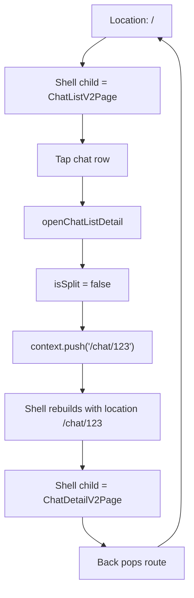
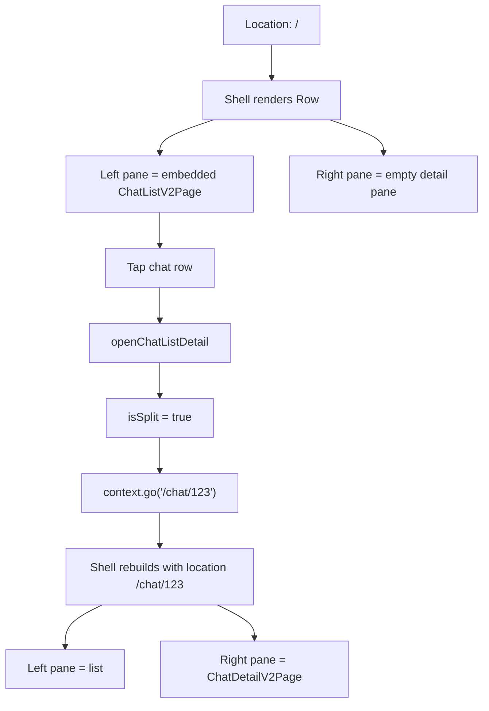

# Chat Workspace Navigation

`ChatWorkspaceShell` wraps the chat branch and adapts the current `go_router`
route child between compact stack navigation and wide split-pane navigation.

## Main Pieces

- `ShellRoute` builds `ChatWorkspaceShell` and passes the matched nested route as
  `child`.
- `ChatWorkspaceShell` decides whether the workspace is compact or split based on
  width.
- `ChatWorkspaceLayoutScope` exposes that decision to descendants.
- `openChatListDetail` and `openArchivedChatList` choose navigation behavior from
  `ChatWorkspaceLayoutScope.isSplitLayout(context)`.
- `chatWorkspaceListScopeProvider` remembers whether the split list pane is
  showing active or archived chats.

## Route Child Examples

| Location | Shell `child` |
| --- | --- |
| `/` | `ChatListV2Page(scope: active)` |
| `/chat/:chatId` | `ChatDetailV2Page` |
| `/chat/:chatId/thread/:threadId` | `ThreadDetailV2Page` |
| `/chats/archived` | `ChatListV2Page(scope: archived)` |
| `/threads/archived` | `ChatListV2Page(scope: archived)` |
| `/thread/:chatId/:threadId` | `ThreadDetailV2Page` |

## Compact Flow

On compact layouts, `ChatWorkspaceShell` is mostly a pass-through wrapper. The
visible page is the route child.

## Split Flow

On split layouts, the shell owns the list pane and uses the route child as the
right detail pane unless the current route is a list root.

## Archived Chats

Archived navigation has two representations:

- Compact: `openArchivedChatList` pushes `/chats/archived`, so the archived list
  is a full page.
- Split: `openArchivedChatList` updates `chatWorkspaceListScopeProvider` to
  `ChatListV2Scope.archived`, so the left pane changes without pushing a route.

If a split layout is already at `/chats/archived` or `/threads/archived`,
`ChatWorkspaceShell` forces the left pane to archived and shows the empty detail
pane. This keeps direct links, refreshes, and resize transitions consistent.
