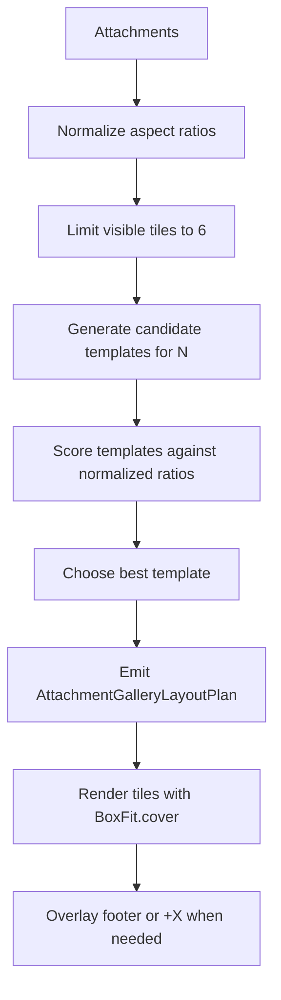

# Attachment Gallery Tiling Spec

## Goal

Define a bounded, aspect-ratio-aware tiling system for image/video attachments in conversation bubbles.

This is for the `visualMedia` branch used by:

- `TextBubbleVisualOnlyContent`
- `TextBubbleVisualWithTextContent`

The implementation home is:

- `lib/features/conversation/message_bubble/presentation/parts/attachment/visual_attachment_gallery.dart`
- `lib/features/conversation/message_bubble/presentation/parts/attachment/attachment_gallery_layout_plan.dart`

## Scope

This spec only applies when:

- every attachment is `image/*` or `video/*`
- the text bubble has already selected the `visualOnly` or `visualWithText` rendering mode

This spec does not apply when:

- any non-visual attachment exists
- the bubble is in the `fileMixed` path

## Product Rules

### High-level behavior

1. Render at most `6` visual attachments.
2. If there are more than `6`, render the first `6` and overlay `+X` on the final visible tile.
3. The layout should feel left-to-right, then top-to-bottom.
4. The layout may be asymmetric.
5. A tile may span multiple rows or columns if the chosen template calls for it.
6. Video attachments participate in the same tiling system as images.
7. All tiles should render media using crop semantics (`BoxFit.cover`) so the tile rect remains authoritative.

### Bubble-specific behavior

- In `visualOnly`, the timestamp/footer overlays on top of the gallery surface.
- In `visualWithText`, the gallery is the top region of the bubble and the text body remains below it.
- Reply quote / thread indicator behavior stays outside the tiling planner.

## Non-goals

- Do not build an arbitrary masonry or packing solver.
- Do not let raw image dimensions directly control bubble height.
- Do not try to display every attachment in a large album inside the message bubble.

## Design Direction

Use a curated template library for `1..6` tiles, then score templates against normalized aspect ratios.

This is intentionally not a free-form packing algorithm. The chat bubble needs predictable layouts more than maximum packing efficiency.

## Visual Model



## Aspect Ratio Normalization

### Why

Raw aspect ratios are not stable enough for bubble layout:

- panoramas can become far too wide
- tall strips can make the bubble extremely tall
- missing dimensions should still produce sane output

The planner should work from a normalized display ratio rather than the raw image ratio.

### Proposed normalization

For each attachment:

1. If width and height are valid and positive, compute `rawRatio = width / height`.
2. Otherwise use `1.0`.
3. Clamp the ratio to a bounded display range.

Suggested initial clamp:

- `minDisplayRatio = 0.67`
- `maxDisplayRatio = 1.7`

This means:

- very tall images are treated as at least `0.67`
- very wide images are treated as at most `1.7`

The actual media is then cropped to the planned tile using `BoxFit.cover`.

### Notes

- The clamp is a planner concern, not a rendering concern.
- The real asset still renders at full resolution inside the tile, but the tile shape comes from the normalized ratio.

## Tile Count Rules

### Visible count

- `visibleCount = min(totalAttachments, 6)`

### Overflow

- `overflowCount = max(totalAttachments - 6, 0)`
- if `overflowCount > 0`, the last visible tile gets an overlay `+overflowCount`

The overflow tile still renders the actual media underneath the overlay.

## Geometry Model

The planner should emit absolute tile frames.

Suggested plan shape:

```dart
class AttachmentGalleryLayoutPlan {
  final double width;
  final double height;
  final List<AttachmentGalleryTilePlan> tiles;
}

class AttachmentGalleryTilePlan {
  final AttachmentItem attachment;
  final double left;
  final double top;
  final double width;
  final double height;
  final int sourceIndex;
  final bool showsOverflowOverlay;
  final int overflowCount;
}
```

### Coordinate system

- `(0, 0)` is the top-left of the gallery canvas
- all tiles are positioned within the gallery bounds
- spacing is represented directly in tile positions

## Gallery Bounds

The gallery should be width-bounded by the bubble.

Suggested initial planner inputs:

- `maxWidth`
- `spacing`
- `minTileSize`
- `maxVisibleCount`

Suggested initial rendering bounds:

- `spacing = 8`
- `maxVisibleCount = 6`
- `minTileSize = 72`
- `targetGalleryHeight` should stay visually bounded and not scale linearly with attachment count

### Height policy

The gallery height should come from the selected template, not from stacking all intrinsic image heights.

For early implementation, prefer a bounded template height strategy such as:

- one-row layouts for `1..2`
- two-row layouts for `3..4`
- two or three rows for `5..6`

## Template Library

The planner should choose from a small set of curated templates.

### 1 tile

- single large tile

### 2 tiles

Candidates:

- `twoColumns`
- `twoRows`
- `primaryLeftTall + secondaryRightTall` if ratio scoring prefers a vertical split

Preference:

- use `twoColumns` by default
- do not switch to stacked just because both inputs are portrait-heavy
- side-by-side is preferred for `2` items

### 3 tiles

Candidates:

- `primaryLeft + twoStackRight`
- `primaryTop + twoBottom`
- `threeColumns`

Primary expected use:

- `primaryLeft + twoStackRight`

This is the first clearly asymmetric mosaic and matches the desired “flow” direction.

### 4 tiles

Candidates:

- `twoByTwo`
- `primaryLeft + threeStackRight`
- `primaryTop + threeBottom`
- `twoTop + bottomWide`

The `primaryLeft + threeStackRight` pattern covers the example shape where one larger tile anchors the left and smaller tiles stack on the right.

### 5 tiles

Candidates:

- `primaryLeft + twoByTwoRight`
- `primaryTop + fourGridBottom`
- `twoTop + threeBottom`

Preferred direction:

- a dominant first tile plus a balanced remainder

### 6 tiles

Candidates:

- `twoColumnsThreeRows`
- `primaryLeft + fiveMosaicRight`
- `threeTop + threeBottom`

For the first version, a bounded grid family is acceptable if it keeps implementation complexity down.

## Template Selection

### Inputs

- visible attachments
- normalized aspect ratios
- max width
- spacing

### Scoring goals

A good template should:

1. preserve a clear reading direction
2. avoid extremely small supporting tiles
3. avoid extreme gallery height
4. assign larger regions to attachments whose normalized ratios fit those regions
5. avoid wasting width with awkward empty space

### Suggested scoring dimensions

- `ratioFitScore`
  Compare each attachment normalized ratio to the ratio implied by its tile frame.

- `balanceScore`
  Penalize templates where one or more non-primary tiles become too small.

- `heightPenalty`
  Penalize overly tall gallery shapes.

- `orderPenalty`
  Penalize templates that feel visually out of order relative to attachment order.

### Practical guidance

Keep the scoring simple and debuggable.

The first implementation should use a small weighted sum rather than anything more complex:

```text
totalScore =
  ratioFitScore
  - heightPenalty
  - tinyTilePenalty
  - orderPenalty
```

## Rendering Rules

### Tile rendering

- render media using `BoxFit.cover`
- clip each tile to its rect
- preserve per-tile tap behavior
- keep video preview overlay behavior

### Corner rounding

- tile corner rounding should be applied only at the outer gallery boundary
- interior tile seams should stay square

### Overflow overlay

If `overflowCount > 0` on a tile:

- add a dark scrim
- center `+X`
- keep the media visible underneath
- always apply the overflow overlay to the last visible tile

### Footer overlay

Only used in `visualOnly`.

This stays as a gallery-level overlay, not a tile-level concern.

## Ordering Rules

Visible attachments keep source order.

Templates may vary which tile is large, but they should not reorder the source list arbitrarily. The first attachment should usually occupy the visually dominant or earliest tile in reading order.

If the first attachment is an image, a later video should not displace it as the dominant tile.

## Fallback Rules

If planner inputs are unusable:

- fall back to the current simple vertical stack behavior

If dimensions are missing:

- use normalized ratio `1.0`

## Implementation Plan

### Phase 1

- extend `AttachmentGalleryTilePlan` to include `left`, `top`, `width`, `height`
- add `sourceIndex`
- add overflow metadata
- change `VisualAttachmentGallery` to render from absolute tile frames

### Phase 2

- implement normalized ratios
- add fixed templates for `1..4`
- keep `5..6` simple but bounded

### Phase 3

- expand template library for `5..6`
- add scoring
- tune thresholds using real message samples

## Suggested Debug Aids

While iterating:

- log chosen template id
- log normalized ratios
- log final gallery size

Optional debug overlay:

- tile index
- normalized ratio
- tile frame dimensions

## Test Strategy

The layout planner should be testable as a pure function:

- input attachments + `maxWidth`
- output `AttachmentGalleryLayoutPlan`

The tests should cover:

- visible count
- overflow metadata on the last visible tile
- tile frames staying inside gallery bounds
- tiles not overlapping
- source order preservation
- `2` portrait items still producing a side-by-side layout
- extreme aspect ratios not causing unreasonable gallery height

## Open Questions

1. Should tile corner rounding be applied per tile or only at the outer gallery boundary?
Resolved: outer gallery boundary only.

2. For `2` very portrait images, is stacked preferred over side-by-side?
Resolved: side-by-side.

3. For `6` items, should the first version always choose a bounded grid before trying more asymmetric shapes?
Resolved: bounded grid is acceptable for the first version.

4. Should the overflow overlay always use the last tile, or only the smallest supporting tile?
Resolved: always the last visible tile.

5. Should videos ever be preferred as the dominant tile when the first attachment is an image?
Resolved: no.

## Current Recommendation

Start with:

- normalized ratio clamp
- explicit templates for `1..4`
- simple bounded layouts for `5..6`
- overflow overlay on tile `6`
- `BoxFit.cover` for all gallery tiles

This gets the bubble out of the current “stack of previews” mode while keeping the logic understandable and stable.
