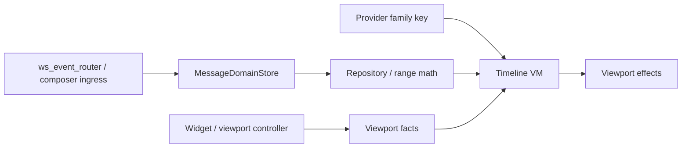
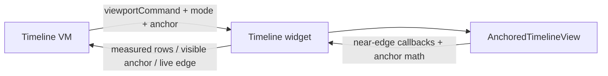
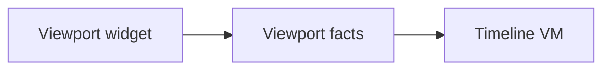
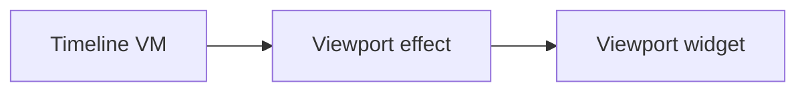
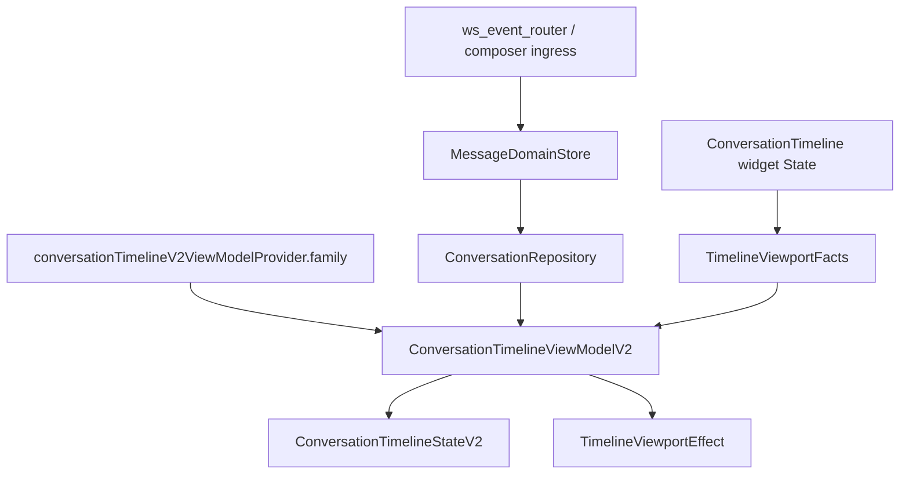

# Conversation Timeline Redesign Learnings

## Purpose

This document captures the main architecture learnings from the Flutter timeline history.
It is intended to guide the `conversation_v2` rewrite so we do not repeat the same classes
of bugs around scrolling, jump-to-message, unread launch, live-edge behavior, and realtime
updates.

This document is complementary to the existing docs in:

- `docs/converstaion/conversation_timeline_requirements.md`
- `docs/converstaion/conversation_timeline_architecture.md`

Those older docs describe product requirements and an earlier architecture direction.
This document is the history-informed redesign summary.

## Problem

The first generation of the Flutter timeline accumulated repeated fixes in the same areas:

- scroll anchoring
- jump-to-message behavior
- unread launch targeting
- live-edge re-entry
- pending live update counts
- visibility-based read tracking
- realtime and optimistic mutation synchronization

The pattern is consistent: timeline bugs often appeared when data-window policy and
physical viewport mechanics were both split across multiple layers.

## Main Takeaway

The timeline should not be modeled as only:

- widget
- view model

The two hard rules are:

- one canonical message store
- facts flow up, effects flow down

Everything else is implementation detail in service of those two rules.

In practice, the runtime shape is:

The key design rule is:

- the provider family key identifies the conversation only
- ingress layers feed the canonical message store
- repository decides what scoped data window exists
- timeline VM decides logical timeline behavior
- viewport/widget decides physical scroll behavior
- `launchRequest` is an initial command consumed by the VM build path, not part of VM identity

## Historical Bug Themes

### 1. Scroll anchoring kept breaking

Relevant commits:

- `396f30e` `flutter: fix chat scroll`
- `cd2015d` `flutter/bugfix: scroll`
- `3c4b1b2` `Redesign Flutter timeline scrolling and preserve history position`
- `5314db4` `Avoid timeline flash when re-entering live edge`
- `729de56` `Refactor timeline ranges and harden jump-to-latest behavior`

Lesson:

- anchored chat scrolling is a real subsystem
- prepend/append preservation is not a normal list concern
- return-to-live-edge is different from full latest bootstrap
- range replacement is different from incremental paging

Implication:

- pixel math and anchor preservation must stay in the viewport layer
- logical range replacement must stay in the VM/repository layer

### 2. Jump targeting and unread launch were underspecified

Relevant commits:

- `41fe1ac` `Find message in window should return null when messsage is not found. Not -1`
- `ebab8cf` `Introduce viewport placement for conversation timeline`
- `18919c5` `Handle unread chat launch intent in conversation view`

Lesson:

- “target not loaded” is a real state
- unread launch is not the same as “jump directly to this message id”
- launch intent must resolve into a concrete anchor and mode before the viewport starts acting

Implication:

- target lookup should use explicit nullable/result types, never sentinel indexes
- initial open and later `jumpTo` should share the same resolve/load/reveal pipeline

### 3. Pending live state was easy to get wrong

Relevant commits:

- `36b3f95` `Fix pending live updates in Flutter conversation timeline`
- `5314db4` `Avoid timeline flash when re-entering live edge`
- `729de56` `Refactor timeline ranges and harden jump-to-latest behavior`

Lesson:

- pending live should be identity-based, not a naive counter
- returning to live edge needs its own explicit path

Implication:

- track pending live as a set of message identities
- clear it on confirmed live-edge re-entry, not on near-bottom heuristics

### 4. Visibility and read tracking had to move closer to the widget

Relevant commits:

- `b3436ef` `feat: enhance message visibility reporting in conversation timeline`
- `cafbb39` `Refresh conversation on app resume`

Lesson:

- the VM cannot infer actual visibility from window state alone
- read state depends on measured row visibility and lifecycle refresh behavior

Implication:

- viewport/widget must report visibility facts upward
- read sync should consume measured facts, not guess from loaded ranges

### 5. Realtime and optimistic mutation flows had to be unified

Relevant commits:

- `aefa96d` `flutter: Implement WebSocket event routing and enhance real-time message handling`
- `b6b2975` `Refactor WebSocket service and conversation handling for improved state management`
- `602df92` `Make edits update optimistically and sync timeline state`
- `523e4e8` `Implement reactive conversation message flow architecture...`

Relevant files:

- [ws_event_router.dart](/Users/codetector/projects/wetty-chat/wetty-chat-flutter/lib/core/network/ws_event_router.dart:1)
- [message_domain_store.dart](/Users/codetector/projects/wetty-chat/wetty-chat-flutter/lib/features/chats/message_domain/domain/message_domain_store.dart:1)

Lesson:

- local optimistic edits/sends/deletes and websocket updates must flow through the same
  canonical message store
- timeline correctness depends on scope-aware reactive cache updates
- cache coherence is not just a repository detail; it is a dedicated seam

Implication:

- the VM should react to canonical cache changes
- the VM should not hand-maintain its own shadow copy of message truth
- websocket ingress and composer optimistic ingress should both feed the store
- v1 registries were workarounds for missing store reactivity, not the right long-term seam

### 6. Chat and thread surfaces needed to converge

Relevant commit:

- `97e69db` `Extract shared conversation surface for chat and thread`

Relevant file:

- [conversation_surface.dart](/Users/codetector/projects/wetty-chat/wetty-chat-flutter/lib/features/chats/conversation/presentation/conversation_surface.dart:1)

Lesson:

- chat and thread should share the same conversation surface contract
- divergence creates duplicated behavior bugs in timeline, composer, sticker panel, and read logic

Implication:

- preserve a shared page/surface layer in `conversation_v2`

### 7. Session lifecycle and app lifecycle were part of correctness

Relevant commits:

- `cafbb39` `Refresh conversation on app resume`

Relevant files:

- [conversation_timeline_view_model.dart](/Users/codetector/projects/wetty-chat/wetty-chat-flutter/lib/features/chats/conversation/application/conversation_timeline_view_model.dart:1)
- [ws_app_visibility.dart](/Users/codetector/projects/wetty-chat/wetty-chat-flutter/lib/core/network/ws_app_visibility.dart:1)

Lesson:

- foreground/background transitions affected timeline correctness
- rapid navigation and provider disposal can leave stale in-flight work unless explicitly guarded

Implication:

- the timeline provider family instance needs an explicit lifecycle/disposal contract
- resume refresh should be a named hook, not incidental behavior

### 8. Non-VM widgets also participated in data coherence bugs

Relevant commits:

- `aa3e2f6`
- `bb2a179`
- `202f1a4`

Relevant files:

- [conversation_timeline.dart](/Users/codetector/projects/wetty-chat/wetty-chat-flutter/lib/features/chats/conversation/presentation/timeline/conversation_timeline.dart:1)
- [message_bubble_meta.dart](/Users/codetector/projects/wetty-chat/wetty-chat-flutter/lib/features/chats/conversation/presentation/message_bubble/message_bubble_meta.dart:1)

Lesson:

- overlay, bubble-meta, and composer-adjacent widgets can regress if they hold stale local
  copies of message state

Implication:

- non-VM readers must read canonical message state via the repository/domain store contract
- v2 should document this explicitly so message overlays and meta widgets do not fork state

### 9. Attachment and audio metadata were pulled into canonical message storage

Relevant commit:

- `8732f63`

Relevant file:

- [message_domain_store.dart](/Users/codetector/projects/wetty-chat/wetty-chat-flutter/lib/features/chats/message_domain/domain/message_domain_store.dart:1)

Lesson:

- attachment/audio metadata cache coherence mattered enough to be unified into the canonical
  message domain

Implication:

- media-derived metadata should be treated as part of canonical message/domain state, not as an
  ad hoc UI-side cache

## Old Architecture Fault Line

The old design ended up with policy split across all 3 timeline layers:

This caused trouble because:

- the VM owned too much viewport protocol
- the widget owned too much data-window policy
- the anchored viewport primitive owned too much behavior instead of just layout

## Target Split

## 1. Provider Key / Initial Resolve

Owns:

- `chatId`
- `threadRootId`

This layer answers:

- what conversation are we opening?
- what initial resolve flow should `build()` run?

This is not a separate runtime layer or provider.
In v2, this should just be the Riverpod `family` key for the timeline VM.

Important distinction:

- provider identity should be only the conversation identity
- `launchRequest` should be passed into VM initialization as an initial command
- the same conversation opened with `latest`, `unread`, or `message(id)` should not become three different VM identities

Recommended key shape:

- `chatId`
- `threadRootId`

Important clarification:

- initial open and in-conversation `jumpTo` are the same operation class
- both should use the same resolve/load/reveal pipeline
- the only difference is when they are invoked

Why this split matters:

- `launchRequest` answers "what should this conversation do first?"
- provider identity answers "which conversation is this?"
- tying `launchRequest` to the provider key couples navigation intent to VM lifetime
- leaving it out preserves one VM per conversation while still allowing initial open to run the same target-resolution pipeline as later jumps

Lifecycle contract:

- provider-family instance creation is tied to a specific conversation identity
- provider disposal must invalidate or ignore in-flight async work for prior sessions
- app resume should trigger an explicit session refresh hook when the timeline is active

## 2. Event Routing / Cache Coherence

Owns:

- websocket event intake
- scope matching
- revision fanout
- local optimistic mutation fanout
- cache invalidation / refresh signals

Relevant seams:

- [ws_event_router.dart](/Users/codetector/projects/wetty-chat/wetty-chat-flutter/lib/core/network/ws_event_router.dart:1)
- [message_domain_store.dart](/Users/codetector/projects/wetty-chat/wetty-chat-flutter/lib/features/chats/message_domain/domain/message_domain_store.dart:1)

This layer answers:

- which conversation scopes are affected by a mutation?
- how do websocket and composer mutations become canonical store updates?
- what canonical scoped change should observers react to?

This concern is intentionally separate from the repository itself:

- `ws_event_router` and composer flows are ingress/adaptation concerns
- `MessageDomainStore` is canonical message truth
- repository owns queries and range math over canonical state

V1 used multiple registries because the repository was not reactive enough.
The leaner v2 direction is:

- websocket ingress calls store apply/update methods
- composer optimistic mutations call the same store apply/update methods
- VM subscribes to store-backed scoped changes through Riverpod

## 3. Repository / Cache

Owns:

- canonical messages
- latest / around-target / older / newer queries
- range math
- canonical metadata such as attachment/audio-derived message data

This layer answers:

- what messages exist?
- what window can be built around a target?
- are there older/newer messages outside the current range?

## 4. Timeline View Model

Owns:

- logical timeline mode
- currently loaded range
- loading flags
- pending live set/count
- jump decisions
- one-shot viewport effects

This layer answers:

- what logical state is the timeline in?
- should we fetch older/newer/around-target/latest?
- should the viewport reveal a target, preserve an anchor, or settle at bottom?

The VM should think in:

- message identities
- ranges
- modes
- effects

The VM should not think in:

- pixels
- row heights
- `RenderBox`
- `ScrollController`

The VM should expose one-shot effects as a stream, not as persistent state that later needs a
consume/ack protocol.

Non-VM reader contract:

- overlay, bubble-meta, composer, and any row-adjacent widget must not keep their own stale
  copies of mutable message state
- they should read canonical message state through repository/domain-store backed flows
- the VM is not the only valid reader, but all readers must use the same source of truth

## 5. Viewport Widget / Controller

Owns:

- `ScrollController`
- threshold detection
- visible-row measurement
- anchor preservation
- effect execution
- read-visibility measurement

This layer answers:

- what is actually visible?
- are we at live edge?
- which row should be used as the physical anchor?
- how do we preserve position after prepend/append?

The viewport layer should think in:

- offsets
- mounted rows
- measurements
- local scroll execution

The viewport layer should not decide:

- repository fetch policy
- launch resolution
- conversation mode transitions

## Facts vs Effects

The VM/widget boundary should stay small and explicit.

### Widget -> VM: one snapshot

The widget should publish one measured viewport snapshot and derive booleans where needed.

Suggested contents:

- `viewportExtent`
- `visibleRows`
- `firstVisibleStableKey`
- `lastVisibleStableKey`
- `latestVisibleMessageId`
- `anchorStableKey`
- `anchorDy`
- `isConfirmedLiveEdge`

The important constraint is:

- widget measures
- VM consumes measured facts
- VM does not guess visibility from logical state

### VM -> Widget: one effect type

The old command taxonomy can collapse into one effect shape.

Suggested contents:

- `stableKey`
  - `null` means bottom sentinel
- `alignment`
  - `top | center | bottom`
- `restoreDy`
  - `null` means no preservation
- `highlight`

This is preferable to:

- persistent state doubling as a command channel
- multiple specialized command variants
- consume/ack transaction protocols

The widget `State` object is already the viewport controller.
V2 should not add a second controller class unless it demonstrably removes complexity.

Important ownership clarification:

- the VM decides whether a jump target is already covered by the current slice
- if yes, the VM emits a reveal effect directly
- if not, the VM enters a resolving state, loads or activates the correct slice,
  then emits the reveal effect after the target becomes renderable
- the widget decides how to execute the reveal:
  - jump
  - animate
  - wait until the target row is mounted

This means:

- VM owns semantic navigation intent and slice replacement
- widget owns physical motion policy and scroll execution
- "highlight this row" is metadata on the reveal effect, not a separate command type

## Important Design Rules

1. One canonical message store is the only mutation path.

2. Event routing/cache coherence is a first-class concern, not a repository implementation detail.

3. Initial open and later `jumpTo` should share the same resolve/load/reveal pipeline.

4. Range replacement, incremental paging, and return-to-live-edge are separate operations.

5. Pending live state must be identity-based and keyed by `stableKey`, not server id.

6. Visibility/read tracking must come from measured viewport facts.

7. Repository/domain state is the canonical source of truth for all readers, not only the VM.

8. Provider/session lifecycle must define disposal, in-flight cancellation, and resume refresh behavior.

9. The VM should own logical policy, not physical scroll mechanics.

10. The viewport layer should own physical mechanics, not fetch policy.

11. Shared conversation surface for chat and thread should be preserved.

## Recommended V2 Shape

Suggested state split:

- `ConversationTimelineStateV2`
  - mutable logical timeline state

- `TimelineViewportFacts`
  - measured widget facts

- `TimelineViewportEffect`
  - one-shot imperative viewport instructions

## Recommended Next Step

The next useful design step is to write the concrete v2 contract:

- `ConversationTimelineStateV2`
- `TimelineViewportFacts`
- `TimelineViewportEffect`
- `ConversationTimelineViewModelV2` responsibilities and public methods

That should happen before wiring real data into `conversation_v2`, so the new code grows around
the right seam instead of recreating the old coupling.
