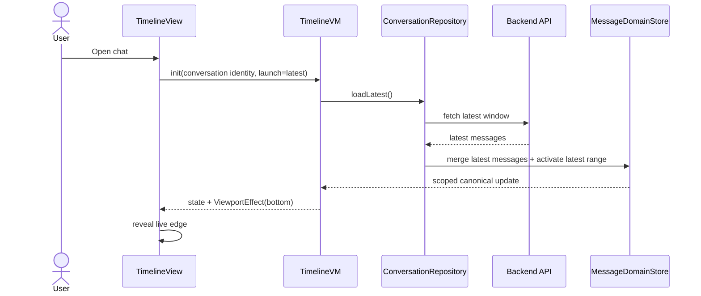
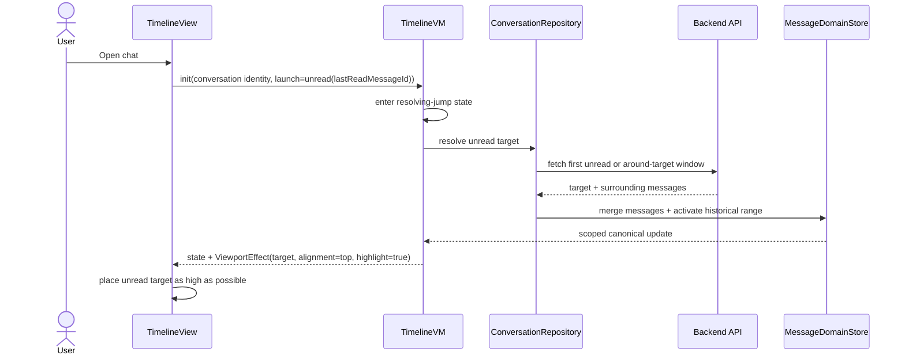
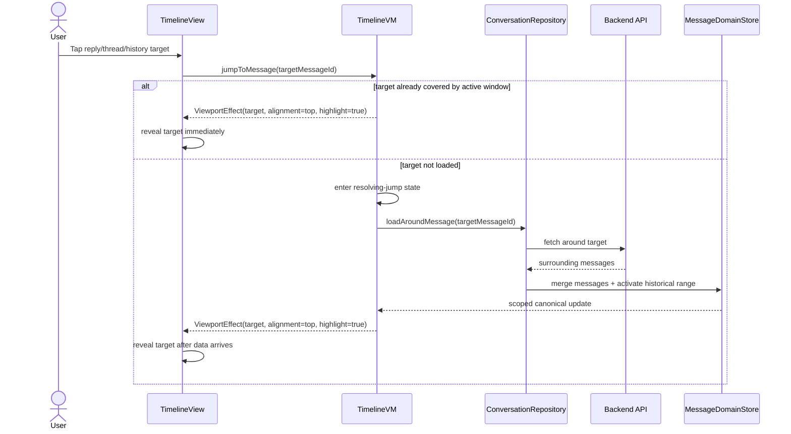
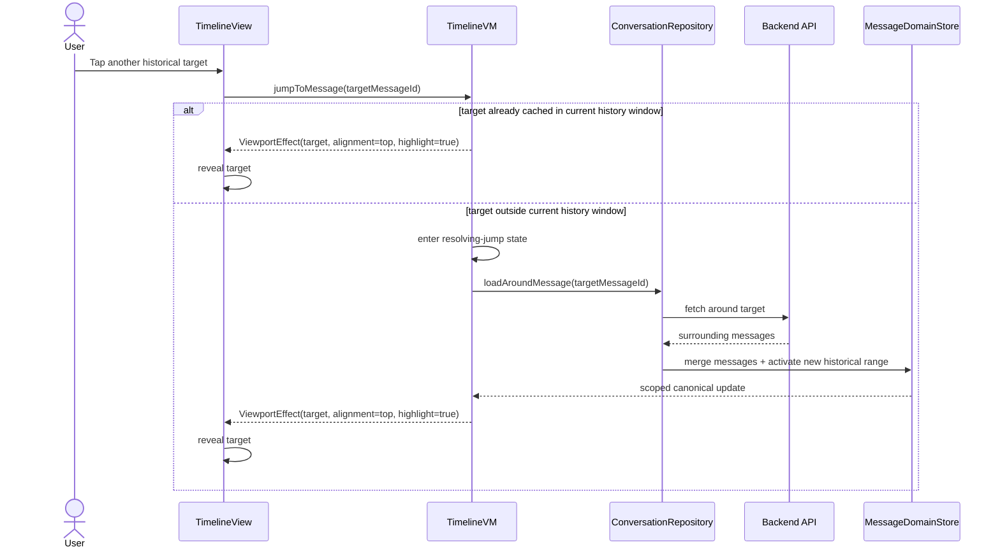
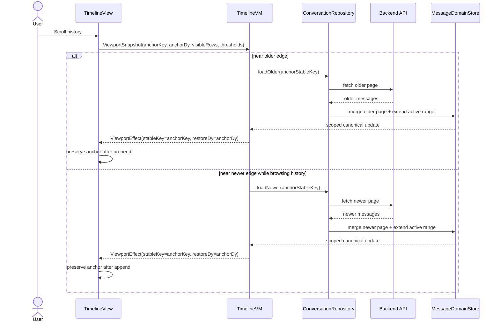
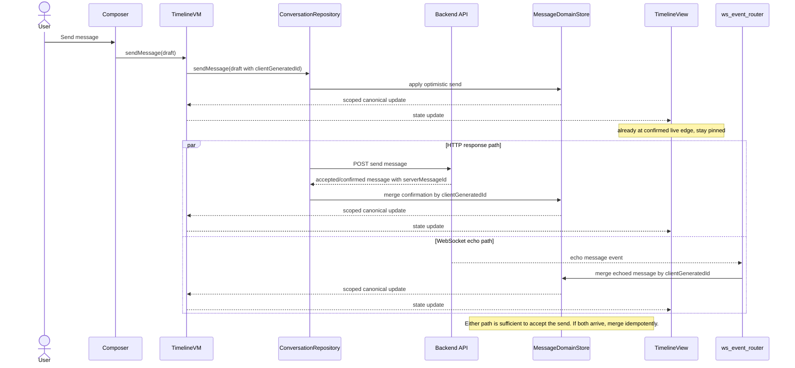
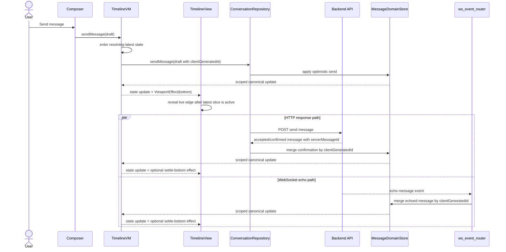
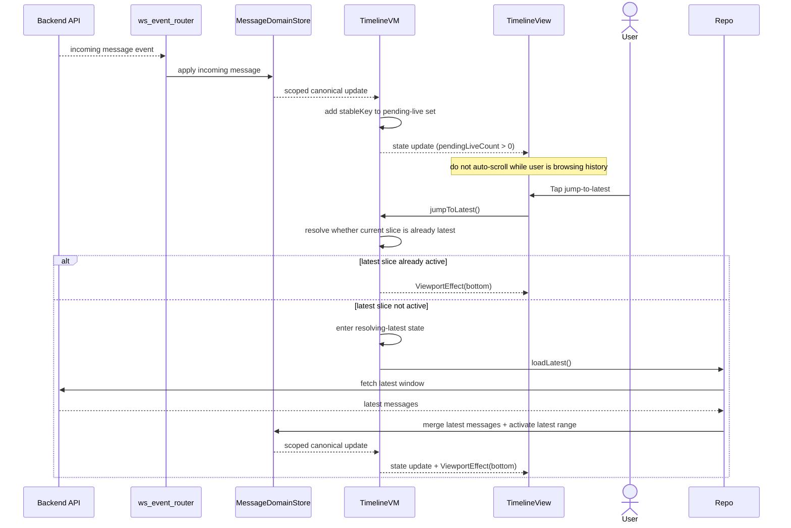
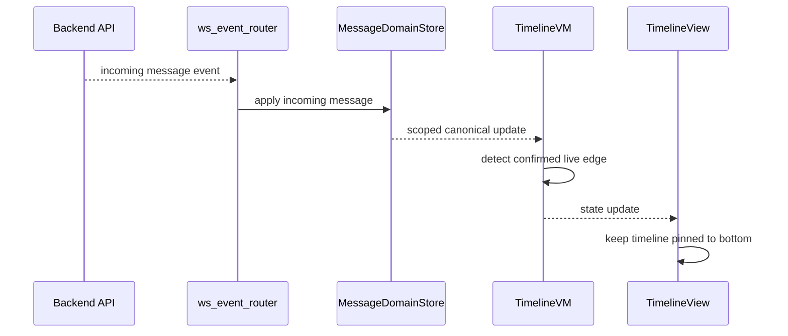
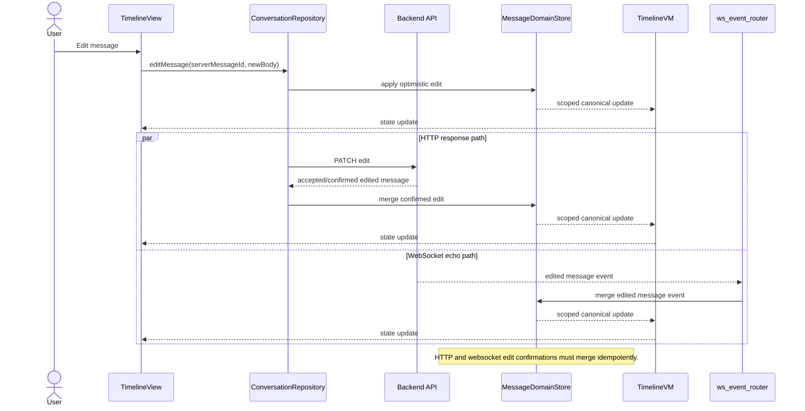

# Conversation Timeline Use Case UML

## Purpose

This document captures concrete timeline use cases as sequence diagrams for the
`conversation_v2` rewrite.

It complements:

- [conversation_timeline_redesign_learnings.md](/Users/codetector/projects/wetty-chat/wetty-chat-flutter/docs/conversation/conversation_timeline_redesign_learnings.md:1)

The goal here is not to restate the architecture rules. It is to show how those
rules play out in specific user-visible flows.

## Shared Runtime Pieces

The diagrams use the same runtime pieces throughout:

- `TimelineView`
- `Composer`
- `TimelineVM`
- `ConversationRepository`
- `MessageDomainStore`
- `Backend API`
- `ws_event_router`

## Shared Rules

- `TimelineVM` issues commands to the repository.
- `Composer` issues send/edit intents to `TimelineVM`, not directly to the repository.
- `ConversationRepository` fetches or mutates through HTTP, then merges results
  into `MessageDomainStore`.
- `ws_event_router` applies websocket mutations into the same store.
- `TimelineVM` reacts to canonical store updates.
- `TimelineView` reports viewport facts up and applies viewport effects down.

For send confirmation specifically:

- the message is keyed by `clientGeneratedId` until or unless a `serverMessageId`
  is needed
- either the HTTP response or the websocket echo is enough to mark the send as
  accepted/confirmed by the server
- if both arrive, the store merges them idempotently by `clientGeneratedId`

For jump handling specifically:

- the VM first decides whether the target is already in the current slice
- if yes, the VM emits a reveal effect directly
- if not, the VM enters a resolving state, replaces or expands the slice, then
  emits the reveal effect after the correct slice is available
- highlight is metadata on the reveal target, not a separate navigation path

## 1. Open A Chat At Latest

## 2. Open A Chat At Unread (History)

## 3. Jump To History From Latest

## 4. Jump To History From History

## 5. Scroll To Load More (Older Or Newer)

## 6. Sending A Message At Live Edge

## 7. Sending A Message While Browsing History

Assumption: existing product behavior is preserved, so sending from history
returns the user to live edge.

The repository call is the same in both send cases.
The difference is VM policy:

- when already at live edge, do not emit a bottom-reveal effect
- when browsing history and product behavior says "send returns to latest",
  switch toward the latest slice, then emit the bottom-reveal effect once the
  correct slice is active

## 8. User Receives A Message While Not At Live Edge

## 9. User Receives A Message While At Live Edge

## 10. User Edits A Message

