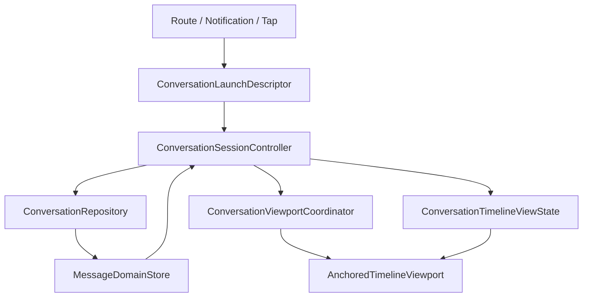

# Conversation Timeline Architecture

## Summary

This document proposes the target architecture for the Flutter conversation timeline overhaul covering:

- chat detail
- thread detail
- launch at latest
- launch at unread
- launch at specific message
- jump to message inside an open conversation

It is based on the product requirements in `docs/converstaion/conversation_timeline_requirements.md` and the current Flutter implementation in:

- `lib/features/chats/conversation/domain`
- `lib/features/chats/conversation/data`
- `lib/features/chats/conversation/application`
- `lib/features/chats/conversation/presentation`
- `lib/features/chats/message_domain/domain`

This is the best-design direction for the stated requirements, not a minimal patch.

## Problem Statement

The current Flutter stack already has the right broad layering:

- `ConversationScope` and `LaunchRequest` define the public conversation contract
- `MessageDomainStore` and `ConversationRepository` normalize message data and paging
- `ConversationTimelineViewModel` orchestrates launch and timeline state
- `ConversationTimeline` and `AnchoredTimelineView` own rendering and scroll behavior

That foundation is usable, but it does not fully satisfy the requirements. The main mismatches are:

- live-edge semantics still use a near-bottom threshold instead of exact-bottom re-entry
- historical placement is still a visible two-step process in some cases
- scroll behavior is derived too heavily from widget state instead of explicit viewport policy
- thread detail does not yet support the same launch modes as chat detail
- some automatic relocations are still coupled to page/widget behavior rather than explicit allowed cases

The core architectural issue is that the current implementation mixes two concerns:

1. What window of messages should exist in memory and be rendered.
2. What the viewport is allowed to do in response to data changes, paging, user drag, and launch intent.

The redesign should keep the existing normalized message foundation, but make viewport behavior explicit and transaction-based.

## Current Architecture Snapshot

### Pieces worth keeping

- `ConversationScope` is the correct cross-chat/thread identity model.
- `LaunchRequest.latest`, `LaunchRequest.unread`, and `LaunchRequest.message` are the correct public intents.
- `ConversationMessage` with stable keys is the correct canonical row identity.
- `MessageDomainStore` is the right place for canonical message reconciliation and optimistic state.
- `ConversationRepository` is the right place for latest loads, around-message loads, paging, and websocket merge logic.
- `TimelineEntry` is the right derived render model for message rows and meta rows.

### Pieces that need reshaping

- `ConversationTimelineViewModel` currently owns both window decisions and one-shot viewport relocation decisions.
- `locatePlan` is directionally correct, but too small a concept for the number of distinct scroll transactions now required.
- `ConversationTimeline` infers live-edge and relocation behavior locally from `ScrollController`, which makes exact compliance difficult.
- `AnchoredTimelineView` relies on post-frame measurement to settle top-preferred placement, which creates a visible correction risk.
- route handling is asymmetric: chat detail accepts `LaunchRequest`, thread detail is latest-only.

## Target Architecture

## High-Level Shape

The target design has four layers:

1. `ConversationLaunchDescriptor`
2. `ConversationRepository` plus `MessageDomainStore`
3. `ConversationSessionController`
4. `ConversationViewportCoordinator` plus `AnchoredTimelineViewport`

The key design rule is:

- repository decides data
- session controller decides intent and policy
- viewport coordinator decides scroll execution
- widget tree renders the result but does not invent policy

## Public Contract

### Keep `ConversationScope`

Keep:

- `ConversationScope.chat(chatId)`
- `ConversationScope.thread(chatId, threadRootId)`

No new scope type is needed.

### Keep `LaunchRequest`, add a route-safe descriptor

Keep `LaunchRequest` as the public feature-level intent:

- `latest`
- `unread(unreadMessageId)`
- `message(messageId, highlight: true|false)`

Add a serializable route/deep-link wrapper, for example `ConversationLaunchDescriptor`, so both chat and thread detail can restore intent after process death or app restoration.

Recommended shape:

- `mode: latest | unread | message`
- `messageId`
- `highlight`

Recommended route encoding:

- chat: `/chats/:chatId?launch=unread&messageId=123`
- thread: `/chats/:chatId/thread/:threadRootId?launch=message&messageId=456`

This is preferable to route `extra`, because the launch intent becomes durable and symmetric across chat and thread.

## Data Layer

### `MessageDomainStore`

Keep `MessageDomainStore` as the canonical in-memory message graph for the current app session.

Its responsibilities should remain:

- canonical message storage
- `stableKey` resolution
- optimistic send/edit/delete reconciliation
- websocket and HTTP merge unification
- thread anchor and thread reply bookkeeping

It should not own viewport state.

### `ConversationRepository`

Keep `ConversationRepository` as the per-scope data source and paging surface.

Its responsibilities should remain:

- latest page load
- around-message load
- older/newer page extension
- reachability knowledge: can load older/newer
- merge pipeline for realtime and HTTP updates
- bounded render window construction from canonical store identity

Extend it carefully in two directions:

1. Return a richer `WindowSnapshot` instead of only `List<String>` when needed.
2. Expose enough metadata for viewport planning without letting the widget inspect repository internals.

Recommended `WindowSnapshot` contents:

- `stableKeys`
- `anchorMessageId`
- `canLoadOlder`
- `canLoadNewer`
- `containsTarget`
- `targetStableKey`
- `unreadMarkerMessageId`

The repository should still avoid any direct scroll math.

## Application Layer

## `ConversationSessionController`

Replace the current "VM owns everything" shape with a more explicit session controller. This can still be an `AsyncNotifier`, but it should produce two outputs:

1. persistent `ConversationTimelineViewState`
2. one-shot `ViewportCommand`

### Persistent state

Recommended `ConversationTimelineViewState` fields:

- `scope`
- `launchRequest`
- `entries`
- `windowStableKeys`
- `windowMode`
- `anchorMessageId`
- `unreadMarkerMessageId`
- `highlightedMessageId`
- `canLoadOlder`
- `canLoadNewer`
- `pendingLiveCount`
- `infoBanner`
- `isLoadingOlder`
- `isLoadingNewer`

Keep the internal modes:

- `liveLatest`
- `anchoredTarget`
- `historyBrowsing`

These are still useful, but they must not be used as a shortcut for viewport truth. `isAtLiveEdge` should come from the viewport coordinator, not from `windowMode`.

### One-shot commands

Replace `locatePlan` with explicit viewport transactions:

- `showLatest`
- `bootstrapTarget`
- `smoothScrollToVisibleTarget`
- `preserveOnPrepend`
- `preserveOnAppend`
- `settleAtBottomAfterMutation`
- `settleAtBottomAfterViewportResize`

Each command should carry a monotonic transaction id so it is consumed exactly once.

This is the main structural change. The current `locatePlan` idea is good, but not expressive enough for all required transitions.

## Viewport Layer

## `ConversationViewportCoordinator`

Introduce a dedicated viewport coordinator responsible for scroll truth.

Recommended responsibilities:

- exact live-edge detection from actual scroll metrics
- active-user-drag detection
- visible-anchor capture for paging preservation
- execution of one-shot viewport commands
- bottom pinning during live-edge mutations and viewport size changes
- suppression of forbidden relocations while browsing history

Recommended state:

- `isAtLiveEdge`
- `isUserDragging`
- `lastVisibleAnchorStableKey`
- `lastVisibleAnchorDy`
- `currentTransactionId`

This coordinator should be owned by the timeline widget subtree, but its policy comes from the session controller.

### Why this layer is necessary

Without a dedicated viewport coordinator, these failure modes remain likely:

- paging changes accidentally relocate the viewport
- realtime updates while in history cause jumps
- keyboard open/close leaves the user slightly above bottom
- send/jump/re-entry rules become mixed with ad hoc widget behavior

## Presentation Layer

## `AnchoredTimelineViewport`

Evolve `AnchoredTimelineView` rather than discard it, but change its contract.

It should accept:

- `entries`
- `viewportPolicy`
- `viewportCommand`
- `onNearOlderEdge`
- `onNearNewerEdge`
- `onVisibleRangeChanged`
- `onViewportStateChanged`

It should not decide:

- whether the app is allowed to relocate now
- whether live edge is active by threshold
- whether a given data change should force a jump

Those decisions belong to the session controller and viewport coordinator.

## Launch and Jump Flows

## 1. Open at latest

Flow:

1. Session controller requests latest window from repository.
2. Controller emits `showLatest(transactionId)`.
3. Viewport coordinator places the list at exact bottom.
4. Coordinator reports `isAtLiveEdge = true`.
5. Realtime bottom mutations stay pinned to bottom unless the user starts dragging upward.

## 2. Open at unread / specific message

Flow:

1. Session controller loads `around(messageId)`.
2. Controller derives entries and anchor decorations.
3. Controller emits `bootstrapTarget(transactionId, messageId, placement: topPreferredAsHighAsPossible)`.
4. Viewport coordinator computes the final feasible placement before first visible presentation.
5. Timeline becomes visible only after that bootstrap transaction is ready.
6. Highlight fades after placement is committed.

### First-visible-paint rule

To satisfy the requirement that historical launches should present directly in the correct final position, the implementation should use a short bootstrap phase for anchored launches and full jumps.

Recommended approach:

- build the target window in an offstage or hidden measurement viewport
- compute the feasible top-preferred alignment from actual rendered extent
- reveal the timeline only after the final alignment is known

This extra step should apply only to:

- unread launch
- message launch
- full jump-to-message rebuilds

It should not be used for ordinary live-edge rendering or normal paging.

## 3. Jump to message from an open conversation

There should be two execution paths:

- `smoothScrollToVisibleTarget` for already visible or near-visible targets
- `bootstrapTarget` for far targets or unloaded targets

Recommended default threshold:

- target already rendered and within about 2 viewport heights, or
- target within roughly 12 to 20 rendered rows

The exact value can be implementation-tuned, but the architecture should keep both paths explicit. They must converge to the same final state:

- target as high as physically possible
- same highlight behavior
- same live-edge determination

## Exact Live-Edge Rules

Live edge must be derived from actual scroll position, not from "close enough" heuristics.

Architecture rule:

- leaving live edge happens on the first deliberate upward drag
- re-entering live edge happens only when the viewport actually reaches bottom
- `jump to latest` visibility follows the viewport truth exactly

Implementation guidance:

- do not use a 50 px near-bottom threshold as the source of truth
- an epsilon for floating-point equality is acceptable
- a policy-level "snap when near bottom" is not acceptable

Recommended check:

- `abs(maxScrollExtent - pixels) <= physicalTolerance`

Where `physicalTolerance` is only for floating-point stability, not for user-facing snap behavior.

## Paging Preservation

Paging should preserve the currently visible content, not merely the same anchor id.

### Older-page load

Flow:

1. Viewport coordinator captures the first stable visible row and its on-screen offset.
2. Repository prepends older rows into the current window.
3. Session controller emits `preserveOnPrepend(transactionId, anchorStableKey, dy)`.
4. Viewport coordinator restores the same visible row to the same visual offset.

### Newer-page load while in history

Use the same flow, but restore the preserved anchor after append.

### Important rule

Do not re-key or fully rebuild the viewport during ordinary paging. A viewport reset is acceptable for launch/bootstrap transactions, but not for history paging.

## Realtime and Row-Level Mutations

## Realtime message created

If viewport is at live edge:

- append into the active window
- keep exact bottom pinned
- do not fight an active upward drag

If viewport is not at live edge:

- merge into canonical store
- update window only if identity needs to stay contiguous
- do not relocate viewport
- increment `pendingLiveCount`

## Realtime edit/delete/reaction

These should never become relocation triggers on their own.

Architecture rules:

- keep message row identity stable by `stableKey`
- mutate rows in place
- tombstone deletes, do not remove rows
- preserve visible-anchor offset in history mode if a row height change occurs above the viewport

Bottom-affecting mutations while at live edge may require `settleAtBottomAfterMutation`, but this should be a bottom-settlement command, not a generic rebuild-and-hope behavior.

## Sending While Reading History

Sending a message is one of the explicitly allowed automatic relocations.

Flow:

1. Composer inserts optimistic row through repository/store.
2. Session controller emits `showLatest` or `settleAtBottomAfterMutation`.
3. Viewport coordinator waits until it can safely perform the relocation.
4. Final state is live edge with the sent message visible.

Important nuance:

- if the user is actively dragging at the exact moment of send, the coordinator must not fight the drag mid-gesture
- the relocation can be deferred until the drag ends
- the final result must still be live edge

## Thread Parity

Thread detail should use the same architecture as chat detail.

Required changes:

- thread route accepts the same launch descriptor as chat route
- `ThreadDetailPage` accepts a `LaunchRequest`
- thread-specific notification/navigation paths can target unread or specific messages
- thread timeline uses the same session controller, viewport coordinator, repository contract, and launch rules

The requirements document is clear that thread detail follows the same scrolling, paging, and launch rules as chat detail. The current latest-only thread behavior should be treated as an implementation gap, not a product simplification.

## Recommended Migration

## Keep

- `ConversationScope`
- `LaunchRequest`
- `ConversationMessage`
- `TimelineEntry`
- `MessageDomainStore`
- most of `ConversationRepository`

## Refactor

- refactor `ConversationTimelineViewModel` into a session controller that emits richer viewport commands
- refactor `ConversationTimeline` so it stops deciding policy locally
- evolve `AnchoredTimelineView` into a viewport primitive that can execute transaction-based commands

## Add

- `ConversationLaunchDescriptor`
- `ConversationViewportCoordinator`
- `ViewportCommand`
- `WindowSnapshot`
- bootstrap measurement path for anchored launches and full jumps

## Implementation Pitfalls

- Do not keep using `canLoadNewer == false && within 50 px` as live-edge truth. That violates the product requirement.
- Do not re-key the entire viewport for paging or routine realtime updates. It will break reading-position preservation.
- Do not let row-level mutations create implicit scroll adjustments. Edits, reactions, and tombstones are content updates, not navigation commands.
- Do not couple highlight timing to a relocation that has not committed yet. Highlight fade must start after the target is in its final position.
- Do not show "message unavailable" as a blocking dialog for fallback. Use a non-blocking banner or inline notice and fall back to latest.
- Do not keep thread detail on a separate behavior model. That guarantees divergence from chat detail over time.
- Do not depend on route `extra` for launch behavior if deep links, restoration, or notification re-entry matter.
- Do not pin the viewport to bottom by assumption after keyboard or orientation changes. Re-run explicit bottom settlement when already at live edge.
- Do not remove deleted rows from the window. Tombstones are important for stable identity and scroll preservation.

## Testing Strategy

Unit tests alone are not enough for this feature. The implementation should add widget or integration tests for:

- latest launch lands at exact bottom
- unread launch lands in final top-preferred position without visible correction
- specific-message launch near end becomes immediate live edge when appropriate
- leaving live edge on first upward drag
- no automatic live-edge re-entry until exact bottom is reached
- older paging preserves visible content
- newer paging preserves visible content
- realtime incoming while in history does not move viewport
- send while in history returns to bottom
- bottom-affecting edit/delete/reaction settles correctly at live edge
- keyboard open and close preserves true bottom when already at live edge
- thread detail launch behavior matches chat detail behavior

## Assumptions and Decisions

- This document assumes thread detail must support historical launches, because the requirements say thread detail follows the same rules as chat detail.
- This document assumes route-restorable launch intent is desirable. If the team deliberately does not want deep-link/restoration durability, `ConversationLaunchDescriptor` can stay internal, but that is a product tradeoff rather than a technical improvement.
- Confirmed product decision: the thread root message participates in the same normal scrollable timeline as other messages. It is not a pinned header. This keeps thread detail aligned with the same viewport rules and live-edge behavior as chat detail.
