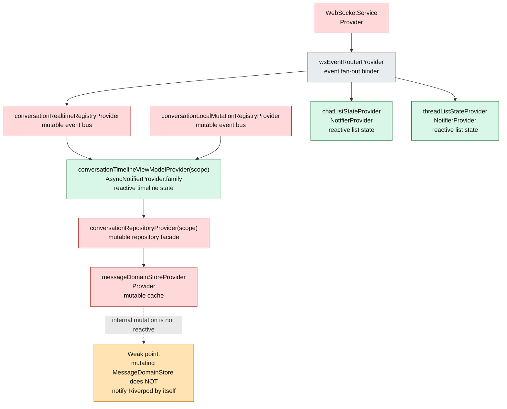
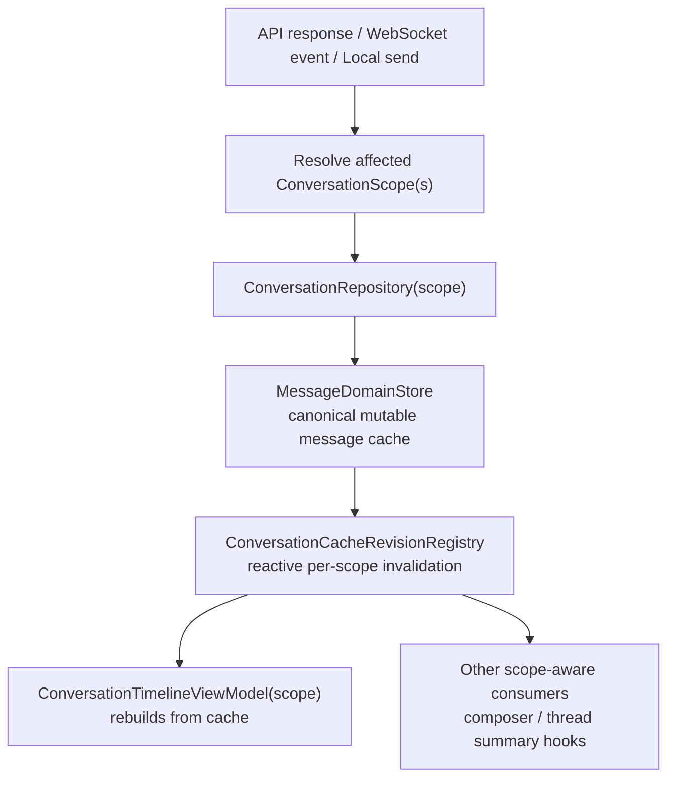
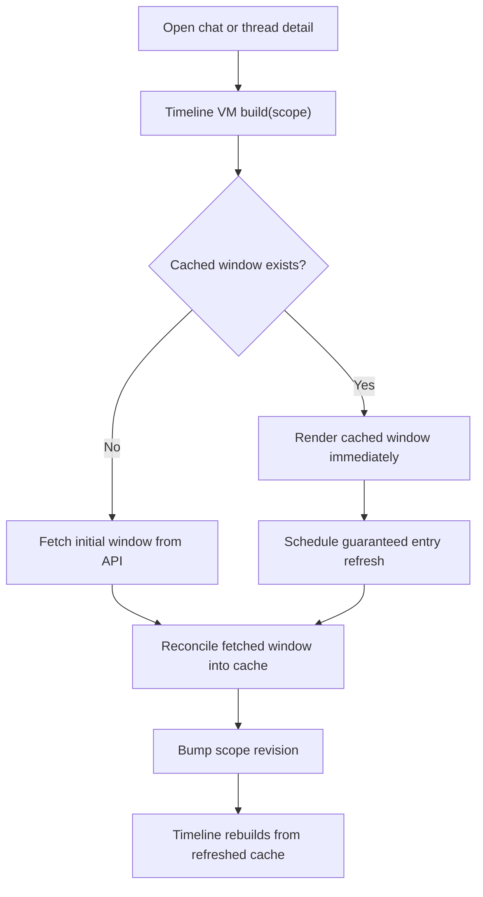
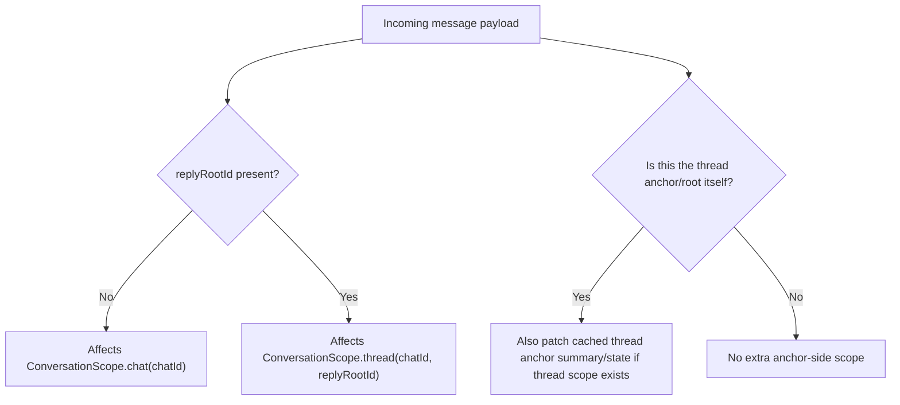
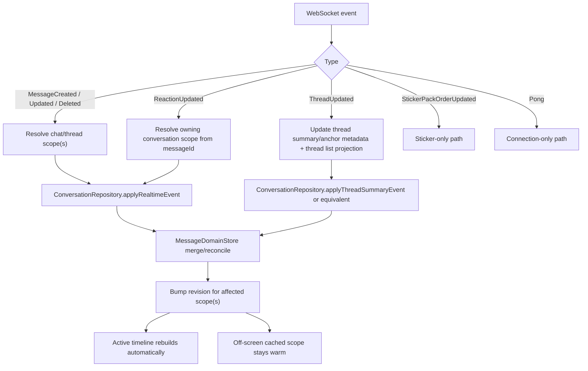
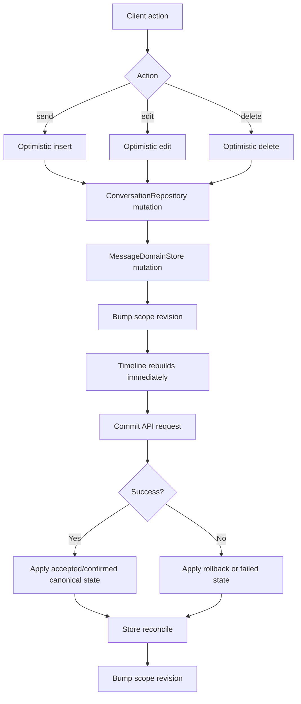
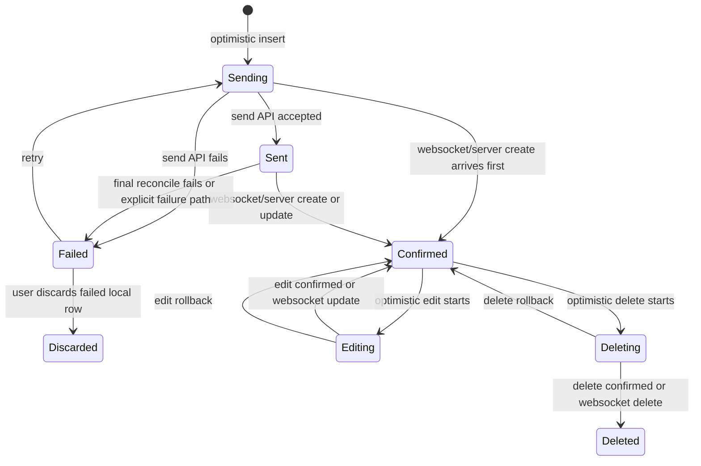

# Reactive Conversation Message Flow Plan

## Summary
Restructure the Flutter chat/thread message system so all message mutations, whether from websocket events, optimistic client actions, or API fetch/commit responses, flow through one canonical cache path and one reactive invalidation path.

The canonical cache remains `MessageDomainStore`. The reactivity is added around it with a per-conversation-scope revision layer so Riverpod can notify timeline consumers when a cached conversation changes.

This document covers:

- the current message flow and its weak points
- the target architecture for chat and thread
- websocket event handling for every relevant event type
- proactive client-side actions: send, edit, delete, retry, discard
- consolidation/reconciliation rules for optimistic and canonical messages

## Current Model

### Current architecture

### Current weak points

1. `MessageDomainStore` is canonical but not reactive.
2. Active timeline correctness depends on manual realtime fan-out.
3. Off-screen cached scopes do not automatically stay warm.
4. Chat/thread list stores are reactive, but timeline message flow is not.
5. The cached-open refresh race can permanently skip the mandatory refresh for a cached conversation.

## Target Model

### Design goals

1. Chat and thread share the same message-flow architecture.
2. On-screen and off-screen cached scopes follow the same correctness model.
3. All message mutations go through `ConversationRepository`.
4. `MessageDomainStore` remains canonical storage.
5. Riverpod reactivity is introduced via scope-based invalidation, not by replacing the whole store with immutable state.
6. Timeline view-models become reactive projections over canonical cache state, not primary message event routers.

### Target architecture

### Open cached conversation flow

## Scope Resolution

### Chat vs thread scope mapping

Rules:

- root chat message: `ConversationScope.chat(chatId)`
- thread reply: `ConversationScope.thread(chatId, replyRootId)`
- thread root patch/delete: update cached anchored thread scope if that thread scope exists
- uncached scopes are not materialized from websocket events alone

## Receive Flow

### Websocket receive flow

### Websocket event matrix

| Event | Scope resolution | Canonical mutation | Reactive effect | Notes |
| --- | --- | --- | --- | --- |
| `MessageCreatedWsEvent` | Root chat scope for root messages; thread scope for replies | Merge canonical create into store | Bump affected scope revision | Must reconcile with optimistic send via `clientGeneratedId` and/or `serverMessageId` |
| `MessageUpdatedWsEvent` | Root chat or thread scope based on payload | Merge canonical update into store | Bump affected scope revision | Must reconcile with optimistic edit |
| `MessageDeletedWsEvent` | Root chat or thread scope based on payload | Apply canonical delete in store | Bump affected scope revision | Must reconcile with optimistic delete |
| `ReactionUpdatedWsEvent` | Resolve owning scope from `messageId` | Patch canonical reactions in store | Bump affected scope revision | Replaces optimistic reaction view with canonical state |
| `ThreadUpdatedWsEvent` | Cached thread scope anchored on `threadRootId` | Patch thread summary/anchor metadata | Bump thread scope revision when cached | Thread list projection still updates separately |
| `StickerPackOrderUpdatedWsEvent` | None | Sticker-only store update | No conversation scope bump | Out of message flow scope |
| `PongWsEvent` | None | None | None | Transport-only |

## Send, Edit, Delete Lifecycle

### Unified outbound message lifecycle

### Send state machine

### Client action matrix

| Action | Optimistic step | Commit step | Failure handling | Consolidation requirement |
| --- | --- | --- | --- | --- |
| Send root chat message | Insert optimistic row in chat scope | `commitSend` marks `sending -> sent` | `markSendFailed` on failure | Must support `sending -> confirmed` and `sending -> sent -> confirmed` |
| Send thread reply | Insert optimistic row in thread scope and update thread anchor semantics | `commitSend` marks `sending -> sent` | `markSendFailed` on failure | Must also preserve thread reply count semantics |
| Retry failed send | Re-enter `sending` using same logical message identity | re-run `commitSend` | back to failed on error | Must not duplicate the message row |
| Discard failed send | Remove failed local-only row | none | none | Must not disturb canonical server messages |
| Edit message | Apply optimistic edited snapshot on existing row | `commitEdit` applies canonical server update | rollback to snapshot | Websocket update must resolve to same canonical row |
| Delete message | Apply optimistic delete/deleting visibility | `commitDelete` finalizes delete | rollback delete visibility/state | Websocket delete must converge on same final deleted state |

## Consolidation Rules

Consolidation is a first-class requirement.

### Identity precedence

1. `serverMessageId` when present
2. `clientGeneratedId` when no server id yet exists
3. local stable key for local-only transient rows

### Required reconciliation rules

- all inbound paths must converge through the same merge logic family:
  - fetch reconciliation
  - websocket create/update/delete
  - optimistic send/edit/delete
  - commit responses
- a canonical websocket create that matches an optimistic row must reuse the same logical row
- an edit websocket update must clear optimistic edit bookkeeping when it matches a locally edited message
- a delete websocket update must resolve any in-flight optimistic delete instead of creating a second transition path
- retry must reuse the existing failed local identity rather than creating a new duplicate row

## Thread-Specific Concerns

Threads add two extra constraints:

1. thread anchor/root semantics
- thread scopes always need the root anchor behavior preserved
- deleting or updating the thread root must keep thread summary state consistent

2. thread summary/list separation
- `ThreadListNotifier` continues to own list row projection:
  - `lastReply`
  - `lastReplyAt`
  - `replyCount`
  - `unreadCount`
- timeline message storage remains in `MessageDomainStore`
- thread list projection must not become canonical message storage

## Proposed Internal Responsibilities

### `MessageDomainStore`
- canonical message storage
- stable key resolution
- optimistic state bookkeeping
- thread anchor state and window membership rules
- fetched-window reconciliation

### `ConversationRepository`
- only entrypoint for message mutations
- realtime event application
- optimistic send/edit/delete transitions
- commit/rollback/failure transitions
- reaction and thread-summary mutation handling
- revision bumping for affected scopes

### `ConversationCacheRevisionRegistry`
- reactive per-scope invalidation layer
- lightweight revision counters or tokens keyed by `scope.storageKey`
- allows Riverpod consumers to react to cache changes without storing full message payloads in provider state

### `ConversationTimelineViewModel`
- reactive projection over cache
- owns viewport-specific UI state only:
  - anchor placement
  - pending live count
  - unread marker placement
  - loading flags
  - highlight state
- no longer the primary correctness path for message delivery

## Migration Notes

### Short-term fixes bundled into the refactor

1. patch cached-open refresh race
- provider-owned refresh scheduling
- do not clear pending refresh before state is available
- one guaranteed refresh per cached open

2. eliminate active-only correctness dependency
- message create/update/delete/reaction flow should no longer rely on `ConversationRealtimeRegistry` for correctness
- active timelines update because they watch revisions
- off-screen cached scopes stay current because the same repository/store path runs for cached scopes

## Test Scenarios

### Websocket coverage

1. root chat `MessageCreatedWsEvent`
- uncached chat scope does not materialize timeline cache
- cached active chat scope rebuilds automatically
- cached inactive chat scope reopens with updated cache

2. thread reply `MessageCreatedWsEvent`
- optimistic pending reply reconciles to canonical confirmed row
- cached inactive thread scope stays warm off-screen
- reply count / preview remain correct in thread list projection

3. `MessageUpdatedWsEvent`
- canonical edit confirmation for root chat message
- canonical edit confirmation for thread reply
- optimistic edit snapshot clears correctly

4. `MessageDeletedWsEvent`
- remote delete without prior optimistic action
- optimistic delete confirmed by websocket
- thread anchor delete preserves summary consistency

5. `ReactionUpdatedWsEvent`
- local optimistic reaction replaced by canonical websocket reaction set
- owning scope revision bumps correctly

6. `ThreadUpdatedWsEvent`
- thread summary patch updates cached thread anchor state
- thread list metadata updates remain correct

### Client action coverage

1. send root message
- `sending -> sent -> confirmed`
- `sending -> confirmed`
- `sending -> failed`
- `failed -> sending -> confirmed`
- discard failed local row

2. send thread reply
- same transition matrix as root message
- thread reply count semantics remain correct

3. edit message
- optimistic edit success
- optimistic edit rollback
- websocket update arrives before local commit path completes

4. delete message
- optimistic delete success
- optimistic delete rollback
- websocket delete arrives during pending delete

### Integration/manual scenarios

1. open thread, leave, receive reply, reopen
2. open chat, stay visible, receive root message
3. send reply from thread, receive websocket confirmation
4. edit message on one client while viewing on another
5. delete thread root and verify anchor/thread summary behavior

## Assumptions

- `MessageDomainStore` remains mutable canonical storage; reactivity is layered around it with per-scope invalidation.
- chat and thread share the same message-flow architecture; only scope resolution and thread-anchor rules differ.
- uncached scopes are not materialized from websocket events alone.
- refresh-on-open remains mandatory even after reactive invalidation is introduced.
- list projection stays separate from canonical message storage.
